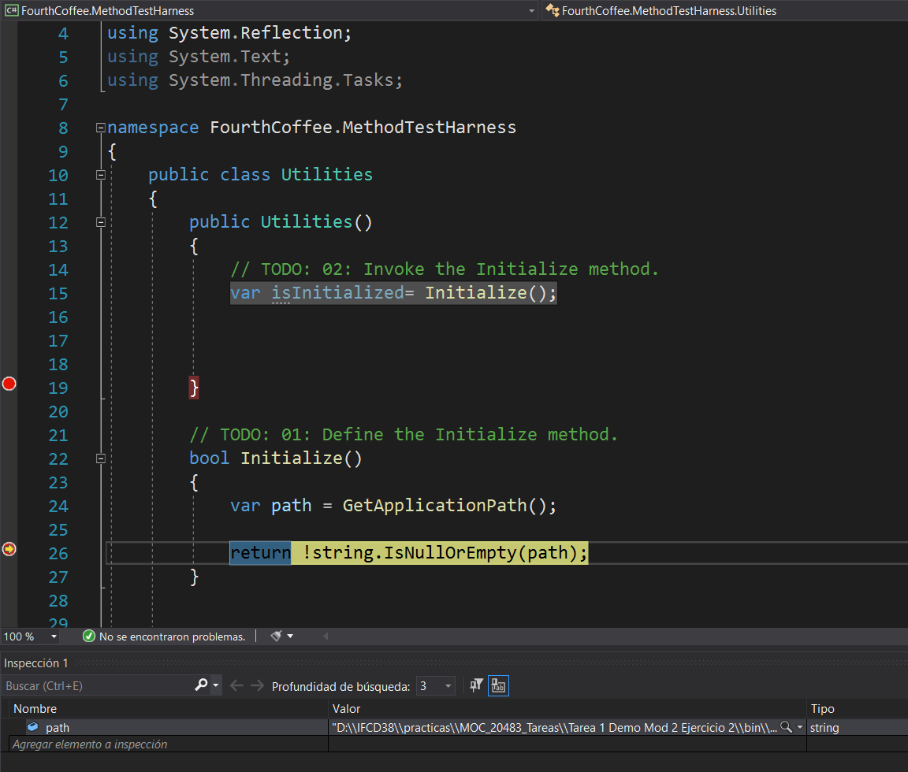
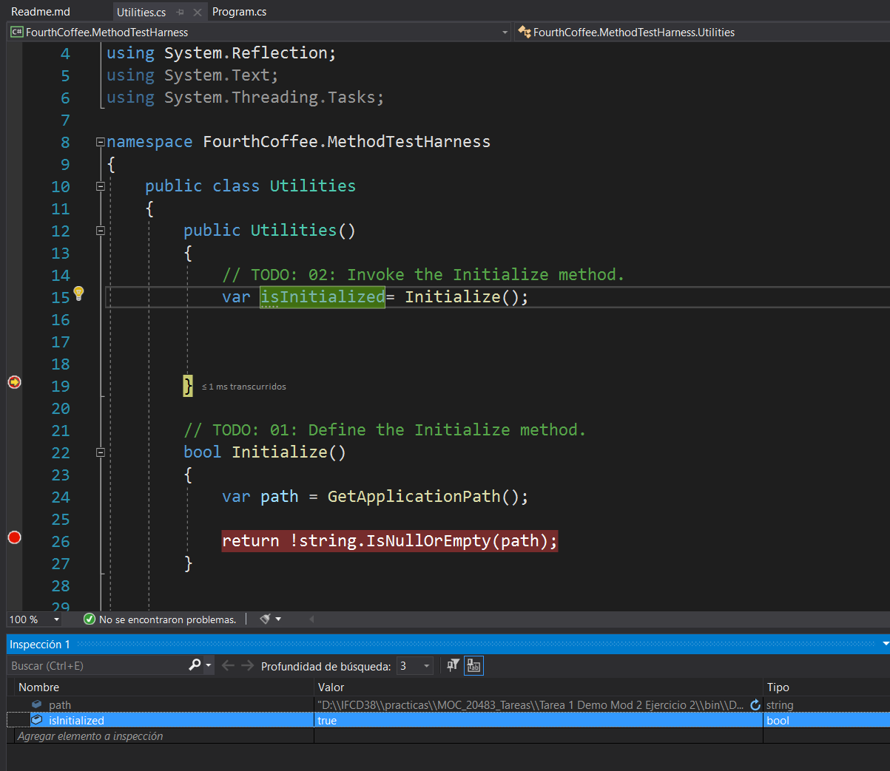

# DemoCode Module 2: Creating Methods, Handling Exceptions, and Monitoring Applications
## Demonstration: Creating, Invoking, and Debugging Methods
### Nombres y apellidos:
Miguel Ángel Cabrero Luengo
### Fecha:
01/11/2020
### Resumen del Ejercicio:

#### Objetivo del ejercicio:
Refactorizar el código de jscriptCompletar el código para poder inicializar los objetos.

Incluir breakpoints para depurar la aplicación y comprobar sus valores

#### Tareas realizadas:

- Actualización de la clase utilities con la inicialización necesaria.

- Incluir puntos de ruptura tanto en la clase utilities como en program.cs para validar datos.

Resultados de ejecución:

#### Primer punto de ruptura:

#### Segundo punto de ruptura:

### Dificultad o problemas presentados y cómo se resolvieron:
No ha presentado problemas.

