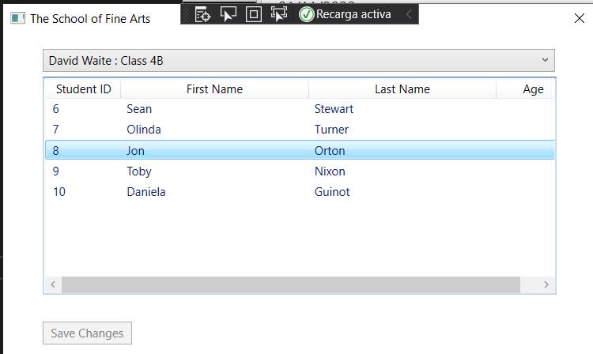
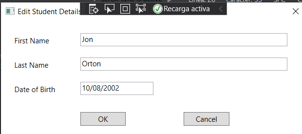

# laboratorio Module 1: Review of Visual C# Syntax
## Exercise 1: Implementing Edit Functionality for the student list
### Nombres y apellidos:
Miguel Ángel Cabrero Luengo
### Fecha:
01/11/2020
### Resumen del Ejercicio:

#### Objetivo del ejercicio:
Mostrar un formulario donde se muestra la lista de eestudiantes.

Detectar la pulsación der la tecla Enter sobre alguno0 de los estudiantes para mostrar el detalle de información el alumno seleccionado.

#### Tareas realizadas:

- Generación de la base de datos

- Añadir código para la detección de pulsación de la tecla enter y obtención del dato seleccionado.

Resultados de ejecución:

#### Pantalla inicial de la aplicación con datos:

#### pantalla con el detalle del alumno seleccionado:

### Dificultad o problemas presentados y cómo se resolvieron:
La base de datos no se reconocía y se tuvo que copiar el script de creación en la propia carpeta del proyecto, además hubo que eliminar los espacios en blanco de la ruta del proyecto.

