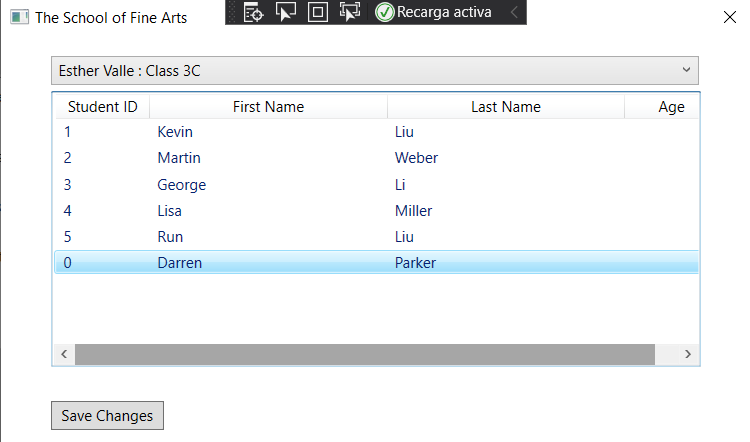

# laboratorio Module 1: Review of Visual C# Syntax
## Exercise 2: Implementing Insert Functionality for the Student List
### Nombres y apellidos:
Miguel Ángel Cabrero Luengo
### Fecha:
01/11/2020
### Resumen del Ejercicio:

#### Objetivo del ejercicio:
Mostrar un formulario donde se muestra la lista de estudiantes.

Detectar la pulsación der la tecla insert para crear un nuevo alumno

#### Tareas realizadas:

- Añadir código para la detección de pulsación de la tecla insert e incorporación del código para generar un nuevo alumno

Resultados de ejecución:

#### Pantalla inicial de la aplicación con datos:

#### Pantalla con el detalle vacío para crear un nuevo alumno:

#### Pantalla con datos rellenos del nuevo alumno:

#### Pantalla con la lista de alumnos, con el nuevo alumno incorporado:

### Dificultad o problemas presentados y cómo se resolvieron:
No se encontró problemas.

