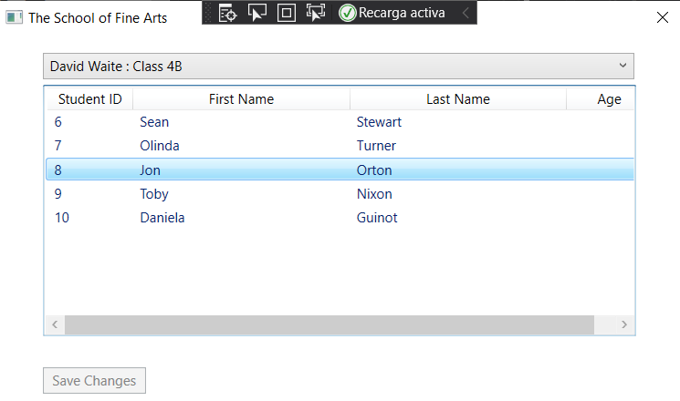
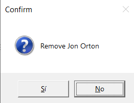
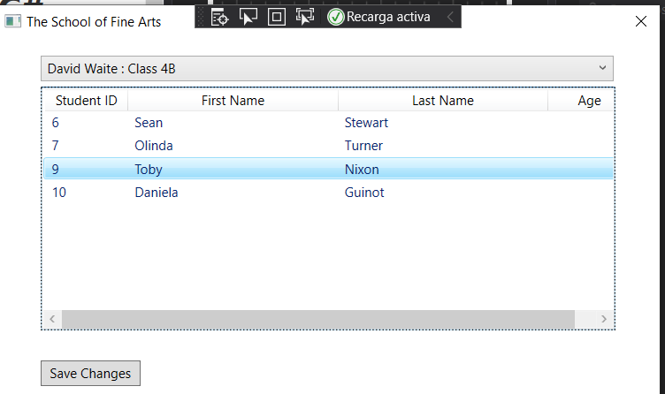

# laboratorio Module 1: Review of Visual C# Syntax
## Exercise 3: Implementing Delete Functionality for the Student List
### Nombres y apellidos:
Miguel Ángel Cabrero Luengo
### Fecha:
01/11/2020
### Resumen del Ejercicio:

#### Objetivo del ejercicio:
Mostrar un formulario donde se muestra la lista de estudiantes.

Detectar la pulsación de la tecla suprimir para eliminar un alumno

#### Tareas realizadas:

- Añadir código para la detección de pulsación de la tecla suprimir y eliminación del alumno seleccionado

Resultados de ejecución:

#### Pantalla inicial de la aplicación con datos:

#### Pantalla con la confirmación de aliminación del alumno seleccionado:

#### Pantalla con datos actualizados sin el alumno borrado:

### Dificultad o problemas presentados y cómo se resolvieron:
No se encontró problemas.

