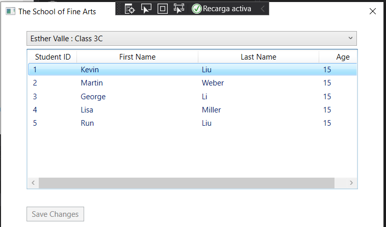
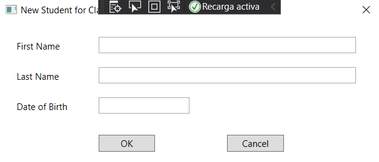
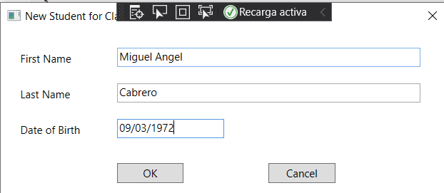
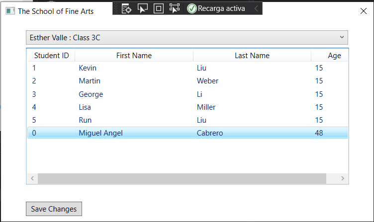

# laboratorio Module 1: Review of Visual C# Syntax
## Exercise 4: Displaying a Student’s Age
### Nombres y apellidos:
Miguel Ángel Cabrero Luengo
### Fecha:
01/11/2020
### Resumen del Ejercicio:

#### Objetivo del ejercicio:
Mostrar un formulario donde se muestra la lista de estudiantes.

Crear un usuario nuewvo y mostrar su edad actualizada al introducir su fecha de nacimiento.

#### Tareas realizadas:

- Añadir código para la detección de pulsación de la tecla insertar, crear un nuevo alumno y calcular su edad a partir de su fecha de nacimiento

Resultados de ejecución:

#### Pantalla inicial de la aplicación con datos:

#### Pantalla vacía para la creación de un nuevo alumno:

#### Pantalla con los datos para la creación de un nuevo alumno:

#### Pantalla con datos actualizados con el lnuevo alumno y su edad calculada:

### Dificultad o problemas presentados y cómo se resolvieron:
No se encontró problemas.

