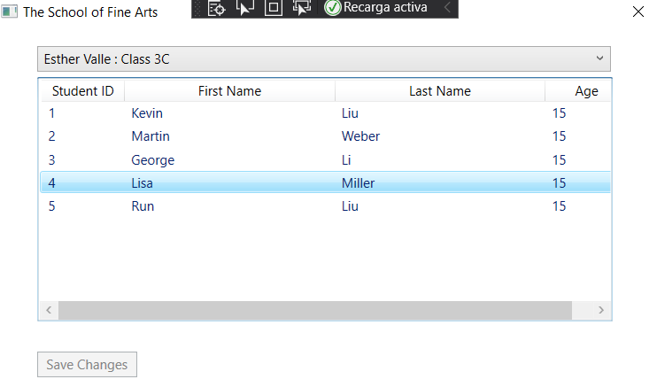
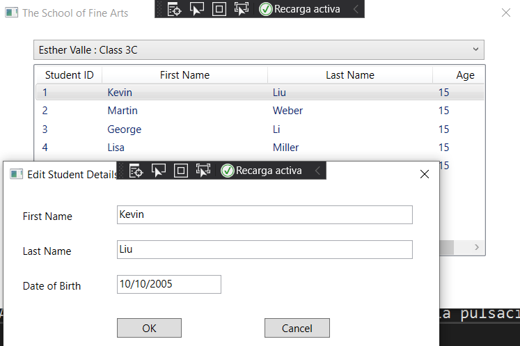

# laboratorio Module 2: Creating Methods, Handling Exceptions, and Monitoring Applications
## Exercise 1: Refactoring the Enrollment Code
### Nombres y apellidos:
Miguel Ángel Cabrero Luengo
### Fecha:
01/11/2020
### Resumen del Ejercicio:

#### Objetivo del ejercicio:
Mostrar un formulario donde se muestra la lista de estudiantes.

Regenerar el código anterior para añadirle nueva funcionalidad para consultar el detalle de un alumno, permitiendo que al pulsar dos veces con el ratón sobre un alumno se muestre su detalle.

#### Tareas realizadas:

- Actualizar la consulta de un alumno, incluyendo la pulsación del ratón.

Resultados de ejecución:

#### Pantalla inicial de la aplicación con datos:

#### Pantalla con los datos del alumno sobre el que se hizo doble click:

### Dificultad o problemas presentados y cómo se resolvieron:
No se encontró problemas.

