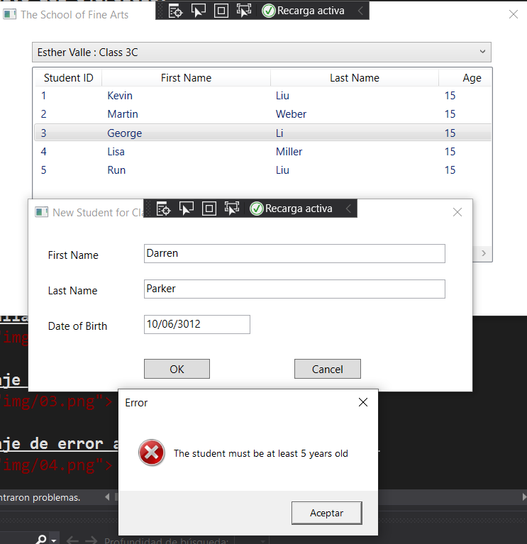

# laboratorio Module 2: Creating Methods, Handling Exceptions, and Monitoring Applications
## Exercise 2: Validating Student Information
### Nombres y apellidos:
Miguel Ángel Cabrero Luengo
### Fecha:
01/11/2020
### Resumen del Ejercicio:

#### Objetivo del ejercicio:
Mostrar un formulario donde se muestra la lista de estudiantes.

Mostrar mensajes de error si no introduce correctamente los datos del formulario.

#### Tareas realizadas:

- Añadir validaciones para cada uno de los campos del formulario de creación de un nuevo alumno.

Resultados de ejecución:

#### Pantalla inicial de la aplicación con datos:

#### Pantalla tras pulsar insert, para crear un nuevo alumno:

#### Mensaje de error al no introducir el nombre:

#### Mensaje de error al no introducir el apellido:

#### Mensaje de error al no introducir la edad:

#### Mensaje de error al introducir edad de alguien menor de 5 años:

#### Actualización de contenido al estar todo correcto:

### Dificultad o problemas presentados y cómo se resolvieron:
No se encontró problemas.

