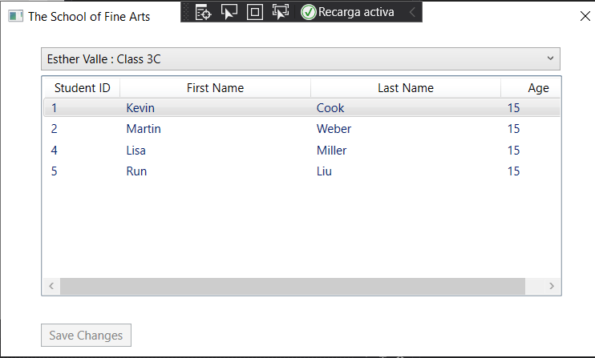

# laboratorio Module 2: Creating Methods, Handling Exceptions, and Monitoring Applications
## Exercise 3: Saving Changes to the Class List
### Nombres y apellidos:
Miguel Ángel Cabrero Luengo
### Fecha:
01/11/2020
### Resumen del Ejercicio:

#### Objetivo del ejercicio:
Mostrar un formulario donde se muestra la lista de estudiantes.

Realizar una operación de edición de un alumno

Realizar una operación de eliminación de un alumno

Confirmar cambios permanentemente en la base de datos.

#### Tareas realizadas:

- Añadir el código para grabar la información en la base de datos.

- Añadir control de excepciones de concurrencia de modificaciones

Resultados de ejecución:

#### Pantalla inicial de la aplicación con datos:

#### Pantalla de modificación de un alumno:

#### Confirmación de datos modificados:

#### Confirmación de eliminación de datos:

#### Muestra lista de datos actualizados. Sin grabar en base de datos:

#### Muestra lista de datos actualizados. Actualizados en base de datos:

### Dificultad o problemas presentados y cómo se resolvieron:
No se encontró problemas.

