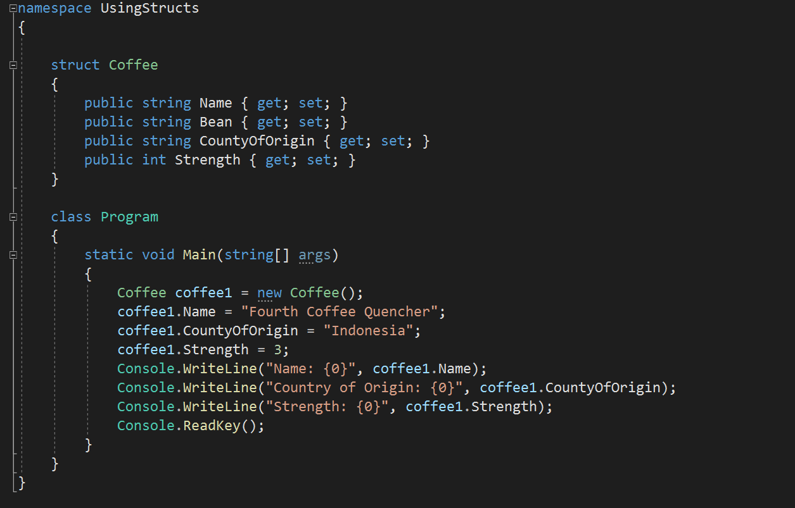

# laboratorio # Module 3:  Developing the Code for a Graphical Application

## Exercise 1:  Implementing Structs and Enums
### Nombres y apellidos:
Miguel Ángel Cabrero Luengo
### Fecha:
14/11/2020
### Resumen del Ejercicio:

#### Objetivo del ejercicio:
Creación y uso de estructuras.

#### Tareas realizadas:

- Se crea una estructura de datos del tipo struct con 4 propiedades.

- Añadir diferentes valores a la estr5uctura anterior y mostrar sus valores por pantalla.

Resultados de ejecución:

#### Definición dde la estructura:

#### Resultado ejecución:

### Dificultad o problemas presentados y cómo se resolvieron:
No se encontró problemas.

