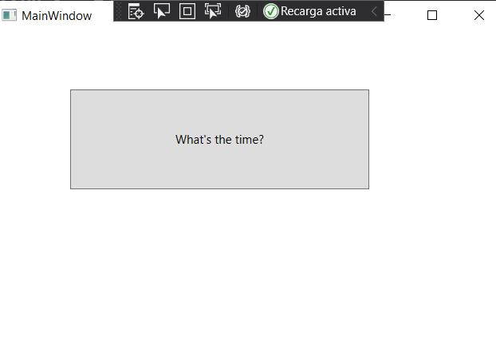
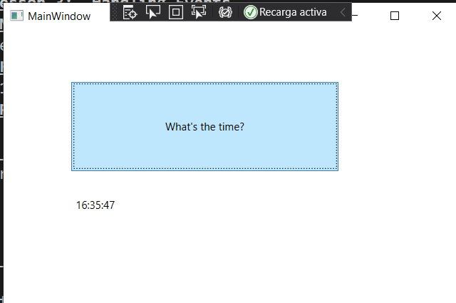

# Module 3:  Developing the Code for a Graphical Application
## Lesson 3:  Handling Events
### Nombres y apellidos:
Miguel Ángel Cabrero Luengo
### Fecha:
01/11/2020
### Resumen del Ejercicio:

#### Objetivo del ejercicio:
Mostrar un formulario donde se muestra una zona donde pueda pulsar el usuario con el ratón.

- Al pulsar el usuario se actualiza una etiqueta de texto mostrando la hora actual.

#### Tareas realizadas:

- Actualizar el contenido de una etiqueta para que reciba el resultado de obtener la hora actual

- Añadir evento click al botón que se meustra en pantalla para actualizar la hora actual.

Resultados de ejecución:

#### Pantalla inicial de la aplicación:

#### Pantalla una vez ejecutado el evento click:

### Dificultad o problemas presentados y cómo se resolvieron:
No se encontró problemas.

