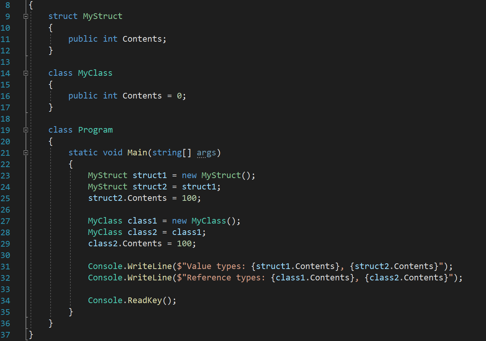
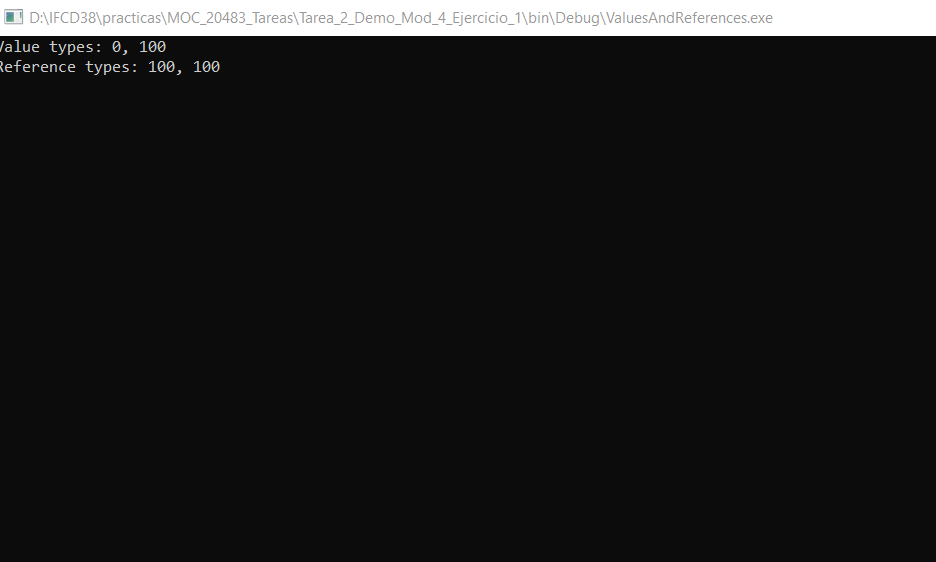

# Module 4: Creating Classes and Implementing Type-Safe Collections
## Lesson 1: Creating Classes
### Nombres y apellidos:
Miguel Ángel Cabrero Luengo
### Fecha:
01/11/2020
### Resumen del Ejercicio:

#### Objetivo del ejercicio:
- Creación de datos usando structuras (struct) y clases (class)

#### Tareas realizadas:

- Definición de los tipos de contenidos.

- Asignar valores a los tipos de contenido.

- Mostrar por pantalla sus valores.

Resultados de ejecución:

#### Pantalla inicial de la aplicación:

#### Pantalla una vez ejecutado:

### Dificultad o problemas presentados y cómo se resolvieron:
No se encontró problemas.

