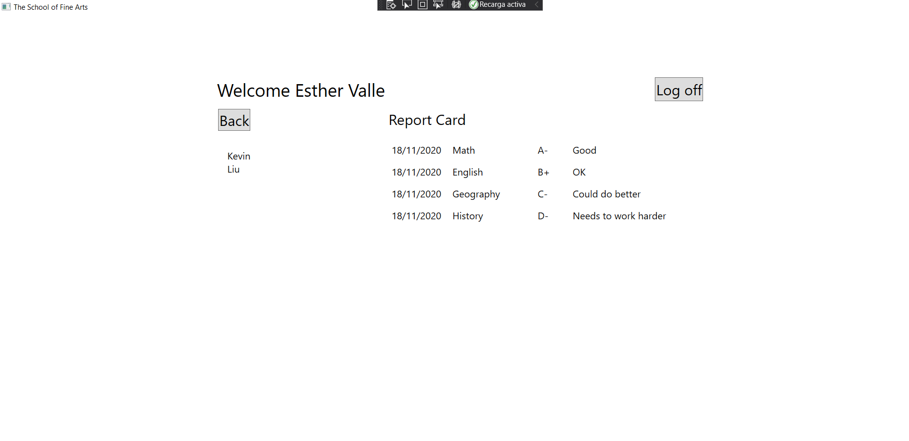

# Module 4: Creating Classes and Implementing Type-Safe Collections
## Exercise 1: Adding Navigation Logic to the Grades Prototype Application
### Nombres y apellidos:
Miguel Ángel Cabrero Luengo
### Fecha:
01/11/2020
### Resumen del Ejercicio:

#### Objetivo del ejercicio:
- Creación de los eventos necesarios para poder identificar a un usuario mediante sus datos de login y en caso de tener permiso mostrarle los datos correspondientes.

#### Tareas realizadas:

- Define el código para la gestión de que el inicio de sesión funcione

- incluir el código para visualizar la pantlla de inicio de sesión

- identifciar el tipo de usuario (estudiante o profesor)

- Gestionar el evento de inicio de sesión

Resultados de ejecución:

#### Pantalla inicial de la aplicación:

#### Pantalla una vez iniciada sesión como profesor:

#### Pantalla consulta detalle de un alumno:

#### Pantalla una vez iniciada sesión como alumno:

### Dificultad o problemas presentados y cómo se resolvieron:
No se encontró problemas.

