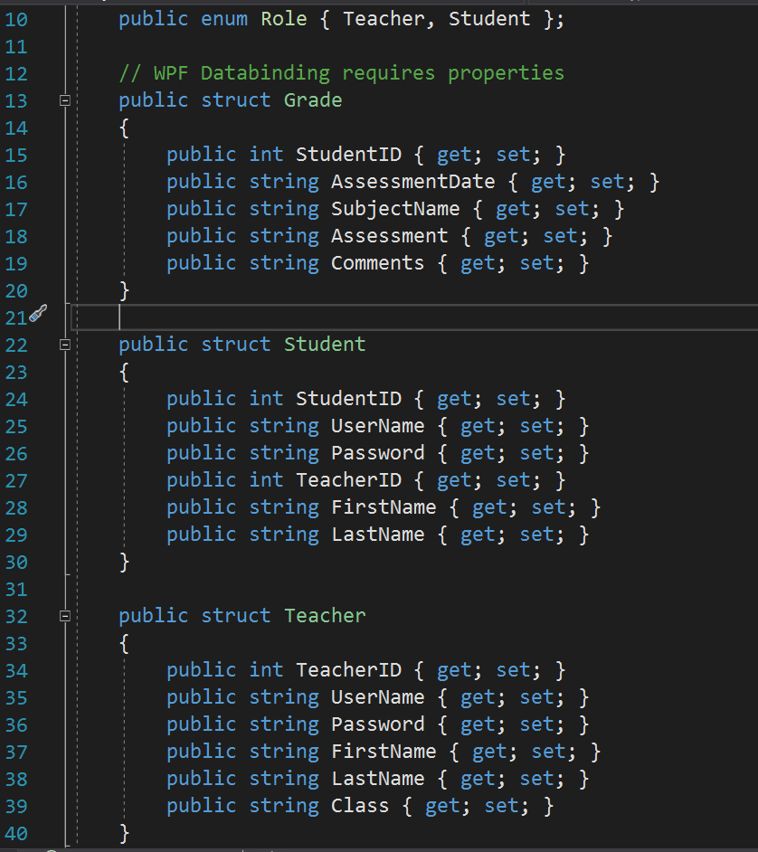
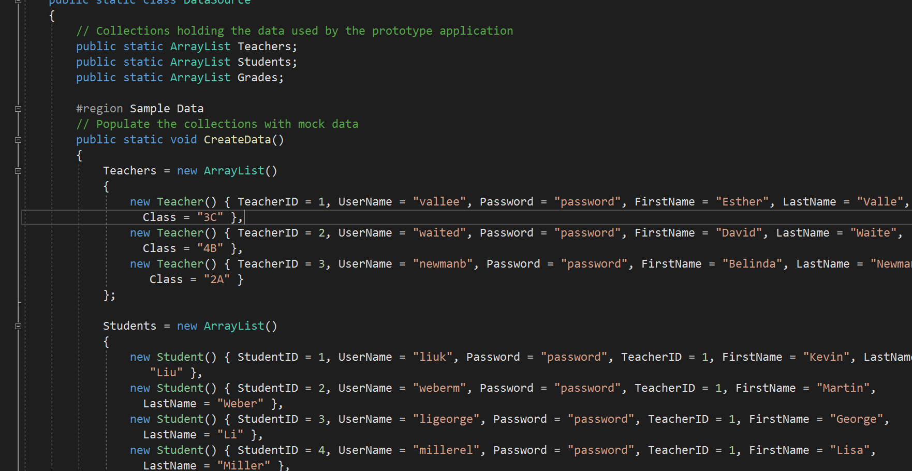

# Module 4: Creating Classes and Implementing Type-Safe Collections
## Exercise 2: Creating Data Types to Store User and Grade Information
### Nombres y apellidos:
Miguel Ángel Cabrero Luengo
### Fecha:
01/11/2020
### Resumen del Ejercicio:

#### Objetivo del ejercicio:
- Gestionar datos usando structuras (struct)

#### Tareas realizadas:

- Definición de los tipos de contenidos para profesor y estudiantes.

- Obtener datos para rellenar las estructuras

Resultados de ejecución:

#### Definición de las estructuras:

#### Rellenado de las estructuras:

### Dificultad o problemas presentados y cómo se resolvieron:
No se encontró problemas.

