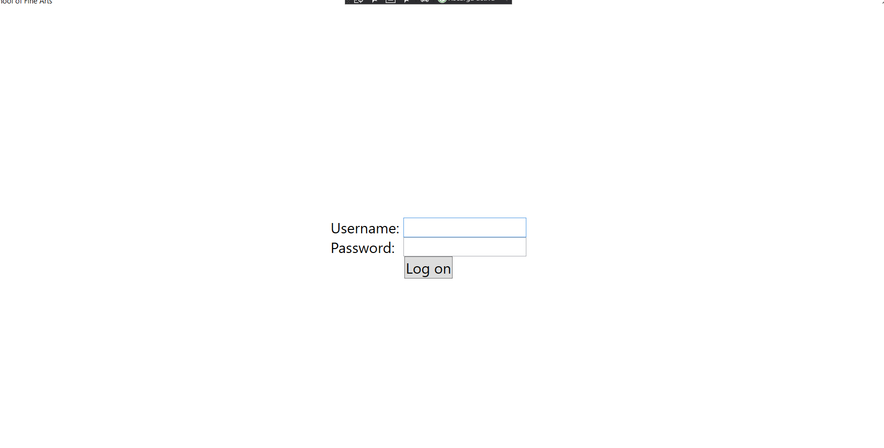
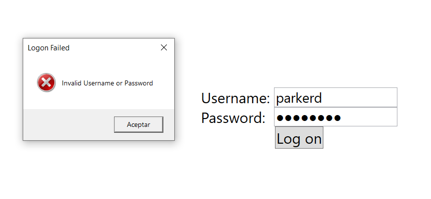
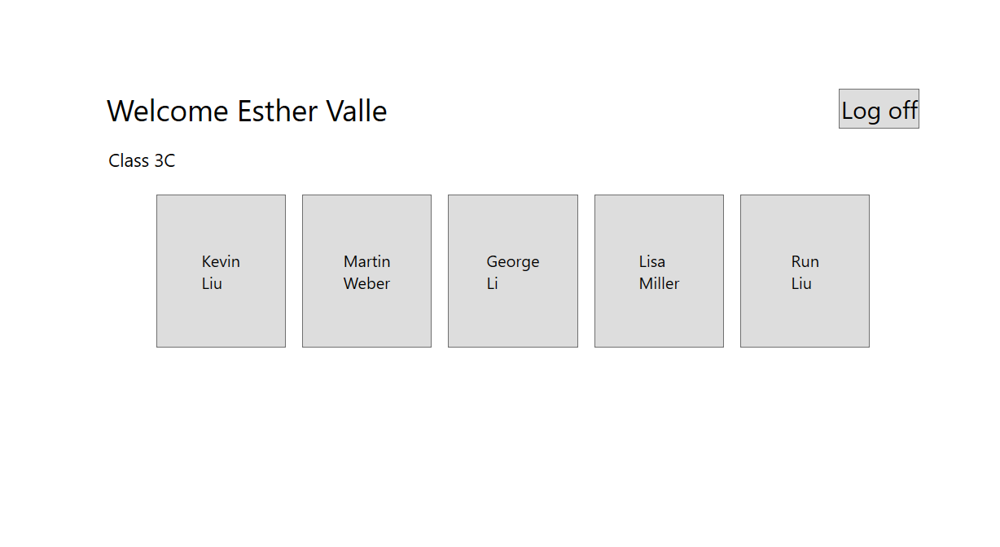
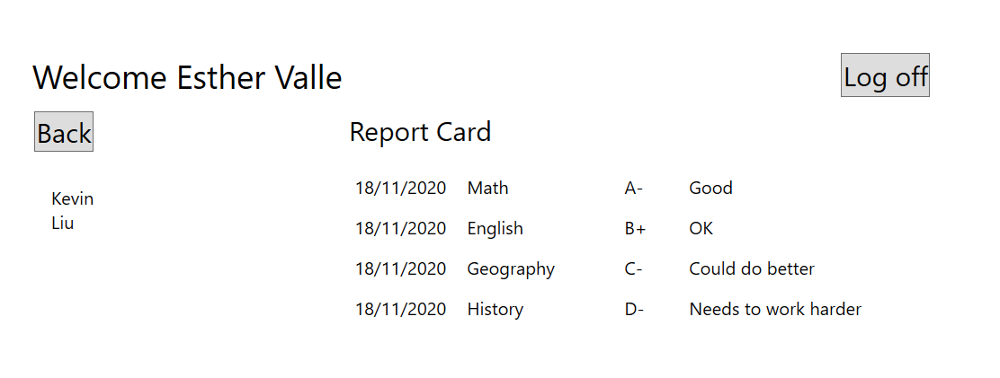
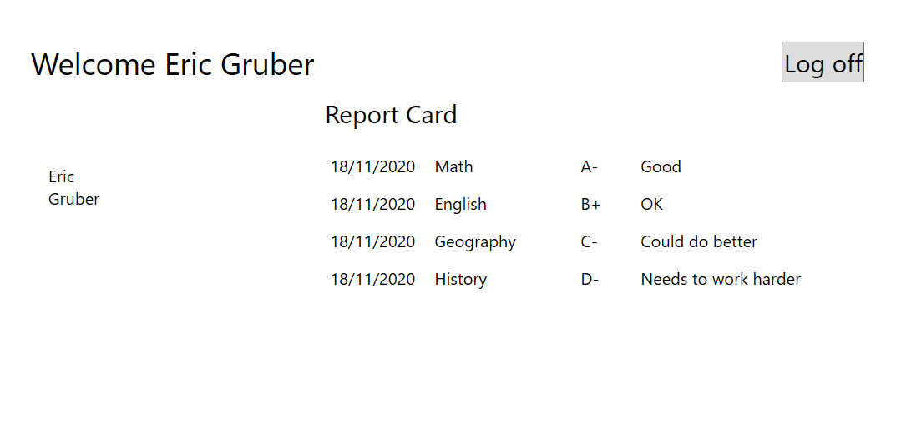

# Module 3: Developing the Code for a Graphical Application
## Exercise 3: Displaying User and Grade Information
### Nombres y apellidos:
Miguel Ángel Cabrero Luengo
### Fecha:
01/11/2020
### Resumen del Ejercicio:

#### Objetivo del ejercicio:
- Actualización de la gestión de profesores y alumnos con nuevos eventos

#### Tareas realizadas:

- Incorporación evento error de inicio de sesión

- Incorporación captura evento error de inicio de sesión

- Mostrar alumnos del profesor actual

- Actualización de información del usuario actual.

Resultados de ejecución:

#### Pantalla inicial de la aplicación:

#### Rechazo de acceso por credenciales erróneas:

#### Pantalla tras login de perfil profesor:

#### Consulta de un alumno del profesor que ha iniciado sesión:

#### Pantalla tras login de perfil estudiante:

### Dificultad o problemas presentados y cómo se resolvieron:
No se encontró problemas.

