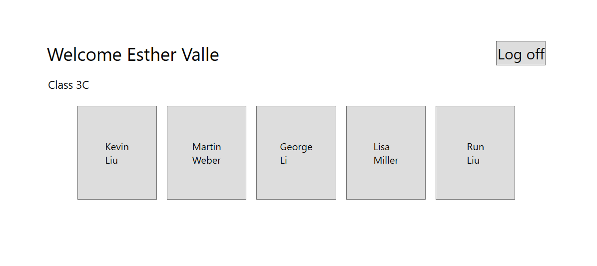
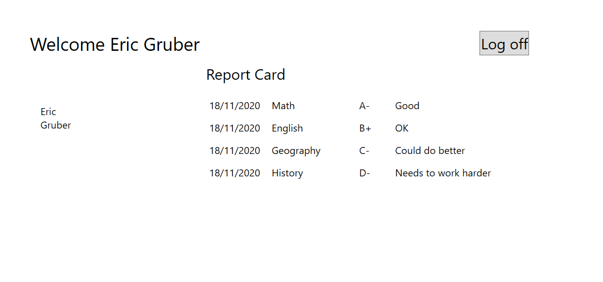

# Module 4: Creating Classes and Implementing Type-Safe Collections
## Exercise 1: Implementing the Teacher, Student, and Grade Structs as Classes
### Nombres y apellidos:
Miguel Ángel Cabrero Luengo
### Fecha:
01/11/2020
### Resumen del Ejercicio:

#### Objetivo del ejercicio:
- Actualización de la gestión de profesores y alumnos usando clases en lugar de struct

- No añade funcionalidad pero si actualiza el enfoque técnico.

#### Tareas realizadas:

- Convertir la gestión de datos de struct en class

- Convertir los datos de profesores y alumnos de struct en class

- Incorporar un nuevo método para verificar la contraseña usando clases en lugar de struct

Resultados de ejecución:

#### Inicio de sesión como profesor:

#### Inicio de sesión como alumno:

### Dificultad o problemas presentados y cómo se resolvieron:
No se encontró problemas.

