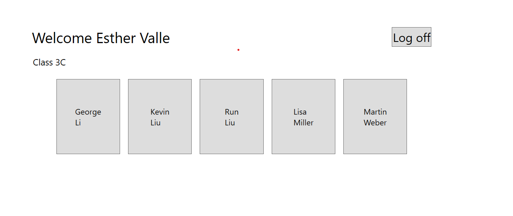

# Module 4: Creating Classes and Implementing Type-Safe Collections
## Exercise 3: Displaying Students in Name Order
### Nombres y apellidos:
Miguel Ángel Cabrero Luengo
### Fecha:
01/11/2020
### Resumen del Ejercicio:

#### Objetivo del ejercicio:
- Añade funcionalidad de ordenación por apellido de los alumnos de un profesor

#### Tareas realizadas:

- Se añade el interface IComparable\<Student\> para poder realizar comparaciones entre estudiantes.

- Se cambia la estructura utilizada para almecenar los estudiantes, de ArrayList se usa una lista de estudiantes.

- Ordenación de la lista por apellido

Resultados de ejecución:

#### Inicio de sesión como profesor, mostrando datos ordenados:

### Dificultad o problemas presentados y cómo se resolvieron:
No se encontró problemas.

