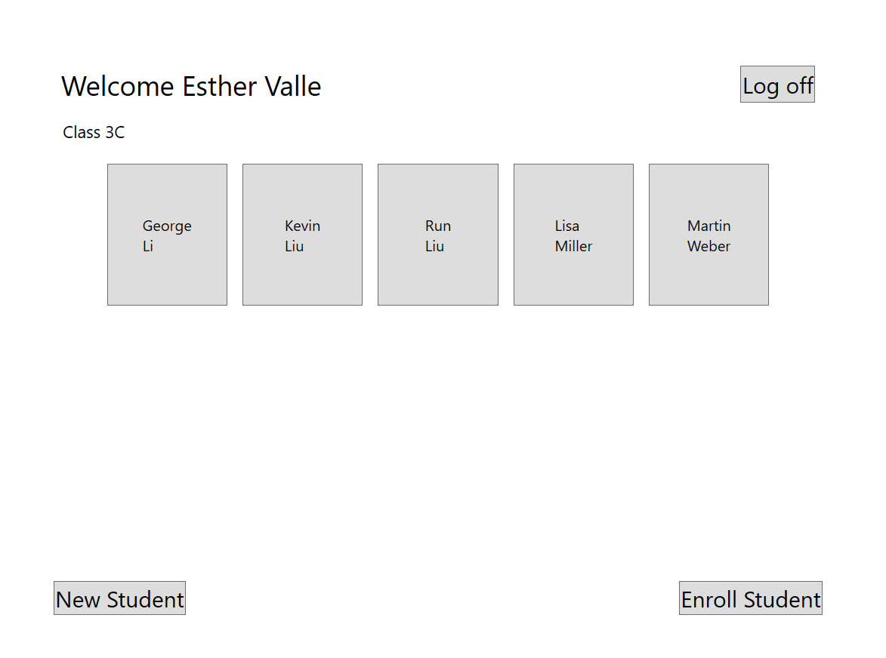
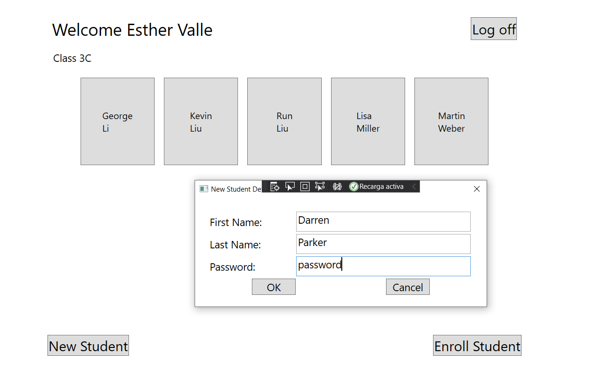
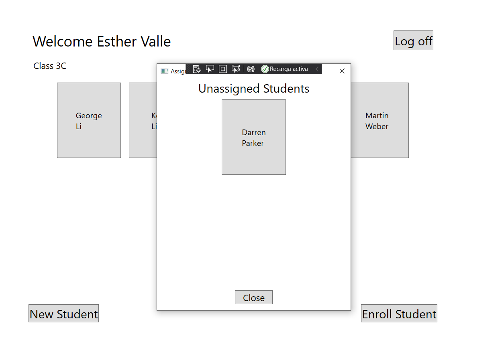
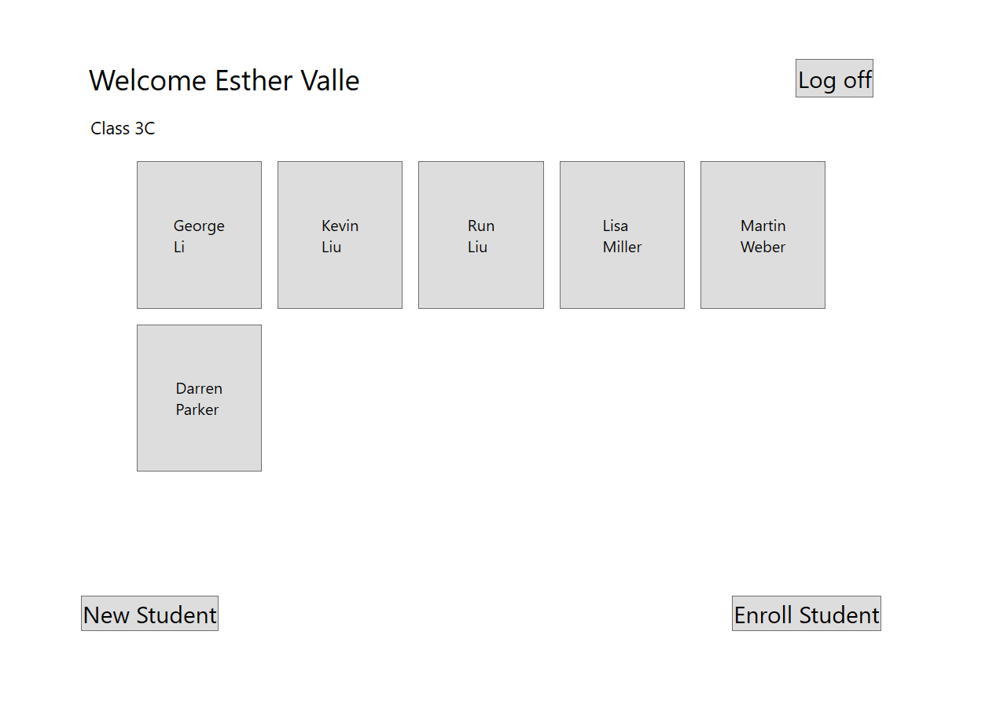

# Module 4: Creating Classes and Implementing Type-Safe Collections
## Exercise 4: Enabling Teachers to Modify Class and Grade Data
### Nombres y apellidos:
Miguel Ángel Cabrero Luengo
### Fecha:
01/11/2020
### Resumen del Ejercicio:

#### Objetivo del ejercicio:
- Actualización de la gestión de profesores y alumnos

- Permite modificar la información de los alumnos

#### Tareas realizadas:

- Reemplaza el uso de colecciones por listas genéricas

- Añade funcionalidad para añadir o aliminar asignaturas de un alumno mediante nuevos métodos en las clases existentes

- Añade funcionalidad para que un alumno se apunte a la clase de un profesor.

- Añade funcionalidad para que un profesor elimine a un alumno de sus clases

- Añade funcionalidad para que un profesor agregue a un alumno de sus clases
 
Resultados de ejecución:

#### Inicio de sesión como profesor:

#### Agregar un nuevo estudiante:

#### Asignar un nuevo estudiante a un profesor:

#### Lista de estudiantes actualizados:

### Dificultad o problemas presentados y cómo se resolvieron:
No se encontró problemas.

