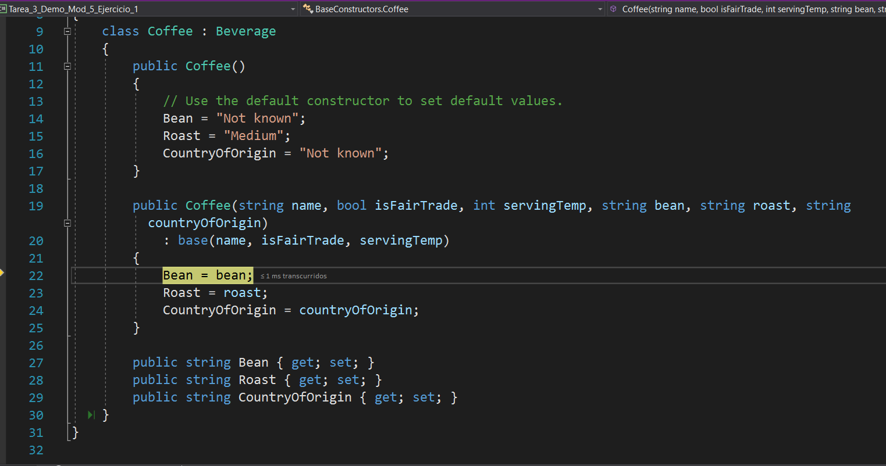

# Module 5: Creating a Class Hierarchy by Using Inheritance
## Lesson 1: Creating Class Hierarchies
### Nombres y apellidos:
Miguel Ángel Cabrero Luengo
### Fecha:
01/11/2020
### Resumen del Ejercicio:

#### Objetivo del ejercicio:
- Uso de herencia y demostración con la llamada de constructores.

#### Tareas realizadas:

- Se crean dos clases, una hereda de otra.

- Se incializan dos objetos invocando al constructor por defecto y a otro personalizado para ver si se llama al constructor padre o el personalizado de la clase hija.
 
Resultados de ejecución:

#### Uso de constructores por defecto:

#### Se invoca al constructor de la clase padre:

#### Se continua en el constructor hijo:

### Dificultad o problemas presentados y cómo se resolvieron:
No se encontró problemas.

