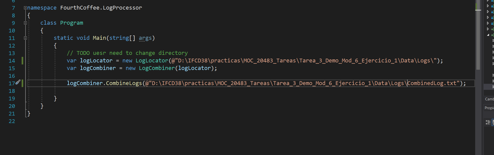
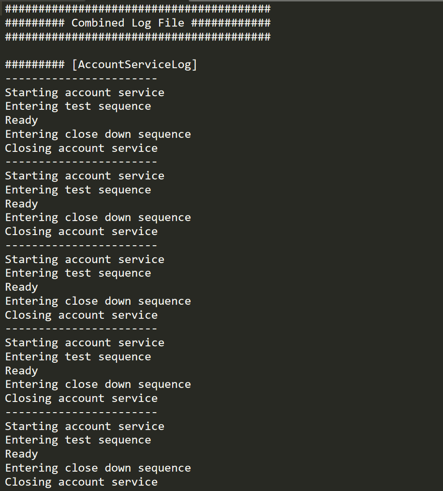

# Module 6: Reading and Writing Local Data
## Lesson 1: Reading and Writing Files
### Nombres y apellidos:
Miguel Ángel Cabrero Luengo
### Fecha:
01/11/2020
### Resumen del Ejercicio:

#### Objetivo del ejercicio:
- Demostración para ver cómo trabajar con directorios ficheros y rutas.

#### Tareas realizadas:

- Uso del objeto Directory

- Uso del objeto File

- Uso del objeto Path

 
Resultados de ejecución:

#### Configuración rutas por defecto:

#### Resultado de lectura y unificación de ficheros de log:

### Dificultad o problemas presentados y cómo se resolvieron:
Las rutas para los ficheros de ejemplo no se cambiaron y dió un error, al copiar la carpeta de ejemplo y actualizar la ruta, todo funcióno ok..

