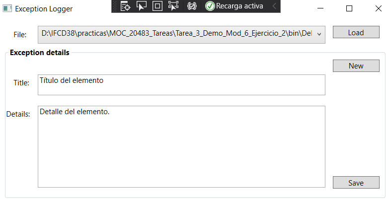

# Module 6: Reading and Writing Local Data
## Lesson 2: Serializing and Deserializing Data
### Nombres y apellidos:
Miguel Ángel Cabrero Luengo
### Fecha:
01/11/2020
### Resumen del Ejercicio:

#### Objetivo del ejercicio:
- Serialización de objetos usando JSON.Net

#### Tareas realizadas:

- Se instala el paquete Newtonsoft.Json

- Se incluye código para usar la librería json
 
Resultados de ejecución:

#### Apertura de aplicación:

#### Selección y visualización del fichero json:

### Dificultad o problemas presentados y cómo se resolvieron:
Adaptación de rutas al fichero local.

