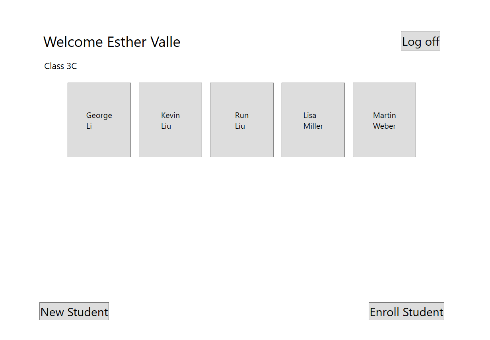
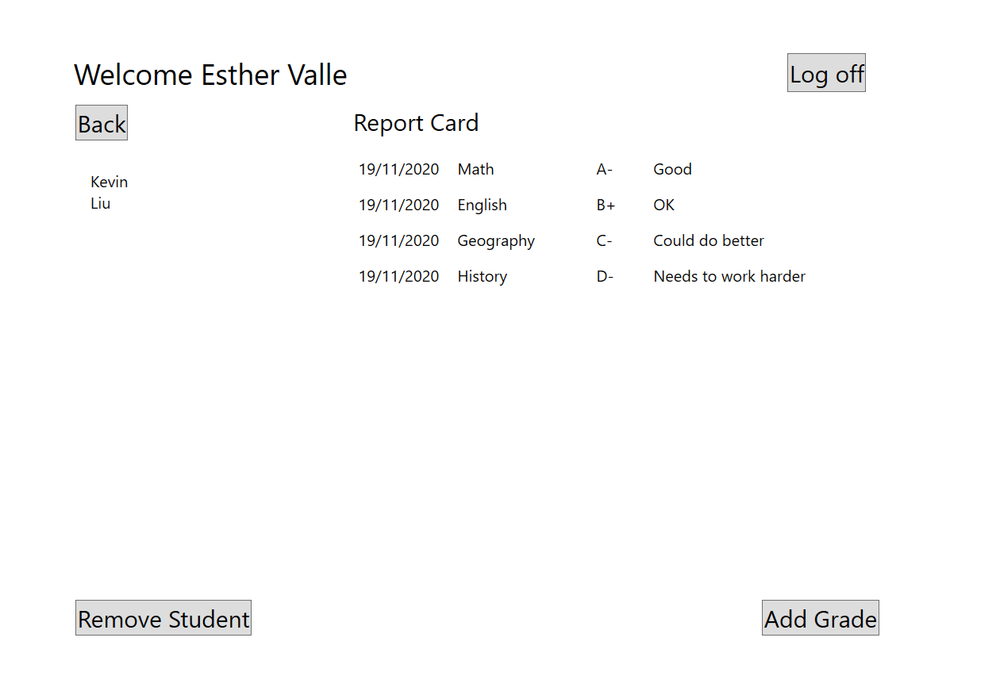

# Module 5: Creating a Class Hierarchy by Using Inheritance
## Exercise 1: Creating and Inheriting from the User Base Class
### Nombres y apellidos:
Miguel Ángel Cabrero Luengo
### Fecha:
01/11/2020
### Resumen del Ejercicio:

#### Objetivo del ejercicio:
- Refactorizar clases para incorporar herencia

#### Tareas realizadas:

- Crear la clase abstracta de usuario para utilizarslo como clase base.

- Modificar las clases de profesor y alumno para heredar de la clase usuario

 
Resultados de ejecución:

#### Acceso con perfil profesor, se muestran sus alumnos:

#### Tras acceder con perfil de profesor se consulta el perfil de un alumno:

#### Se accede con el usario de un alumno y se muestra su perfil:

### Dificultad o problemas presentados y cómo se resolvieron:
No se encontraron problemas.

