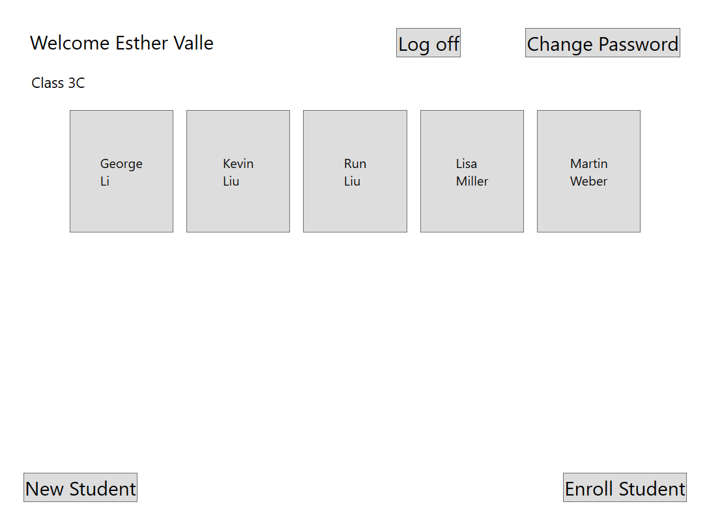
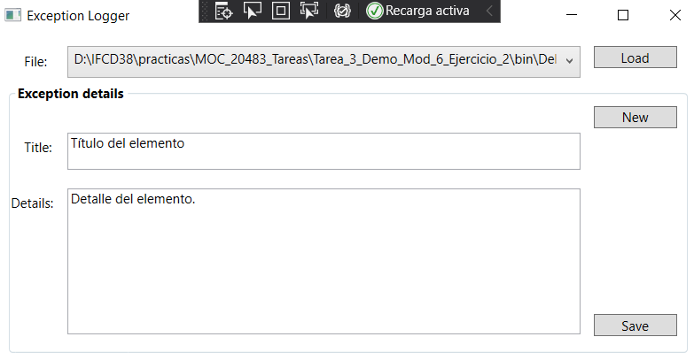
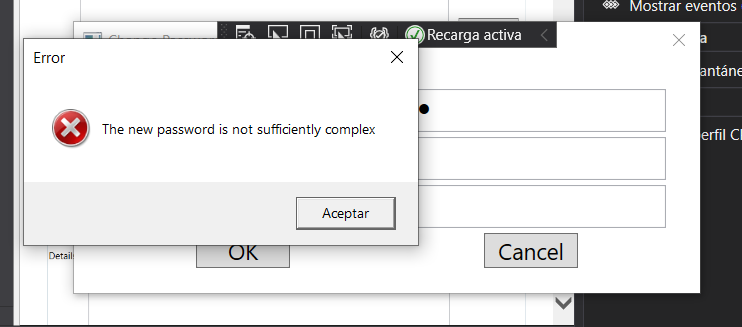
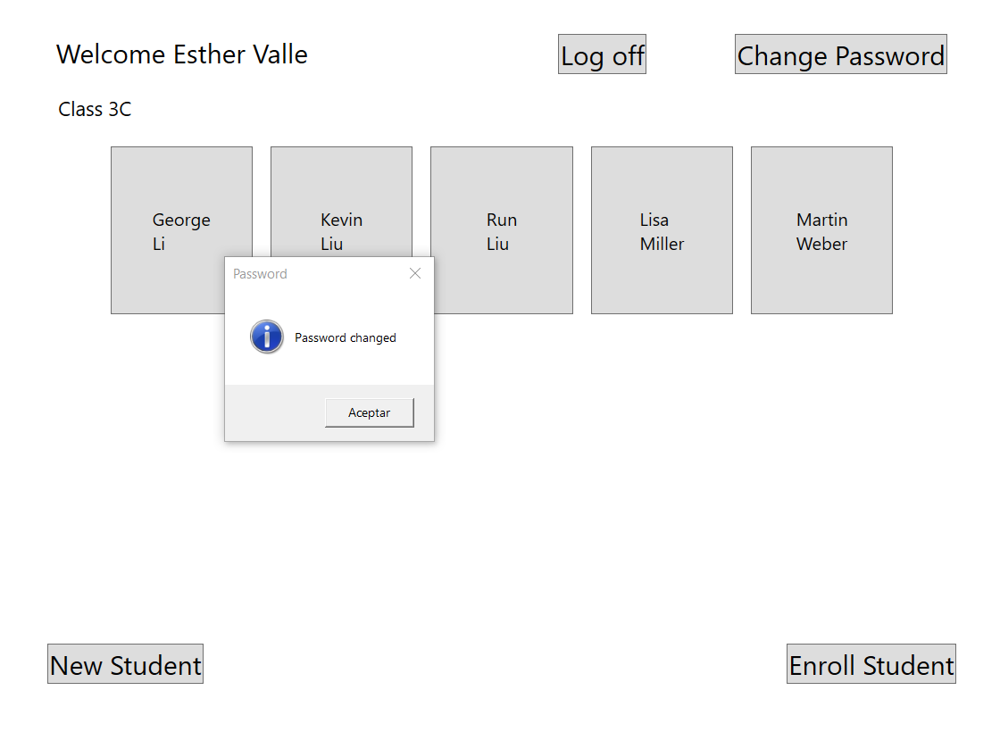

# Module 5: Creating a Class Hierarchy by Using Inheritance
## Exercise 2: Implementing Password Complexity by Using an Abstract Method
### Nombres y apellidos:
Miguel Ángel Cabrero Luengo
### Fecha:
01/11/2020
### Resumen del Ejercicio:

#### Objetivo del ejercicio:
- Refactorización de código para usar herencia y clases abstractas.

#### Tareas realizadas:

- Se incluye un método abstracto para actualizar la contraseña

- Se incluye código para usar el método abstracto para actualizar la contraseña.

- Se incluye código para usar el método abstracto para un nuevo estudiante.

- Se incluye código para actualizar la contraseña de un usuario existente.
 
Resultados de ejecución:

#### Iinicio de aplicación con rol de profesor.:

#### Actualización de la contraseña anterior:

#### Validación complejidad de la nueva contraseña con error:

#### Validación complejidad de la nueva contraseña correcta:

### Dificultad o problemas presentados y cómo se resolvieron:
No se encontraron problemas.

