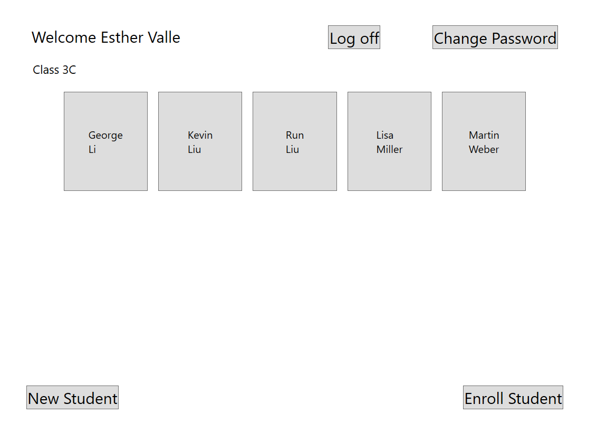
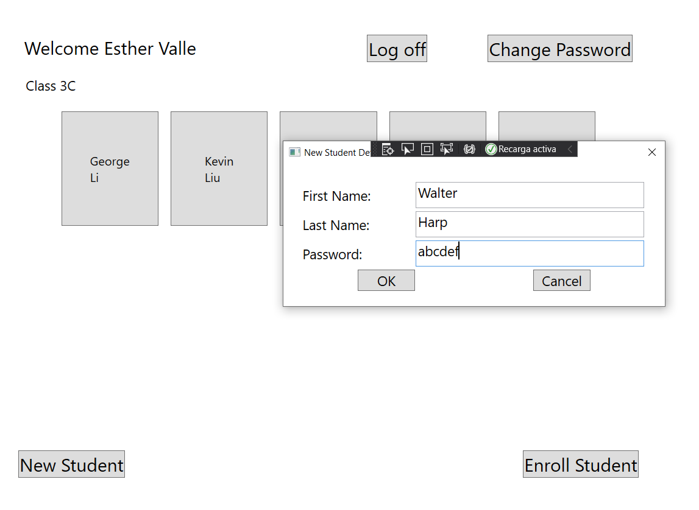
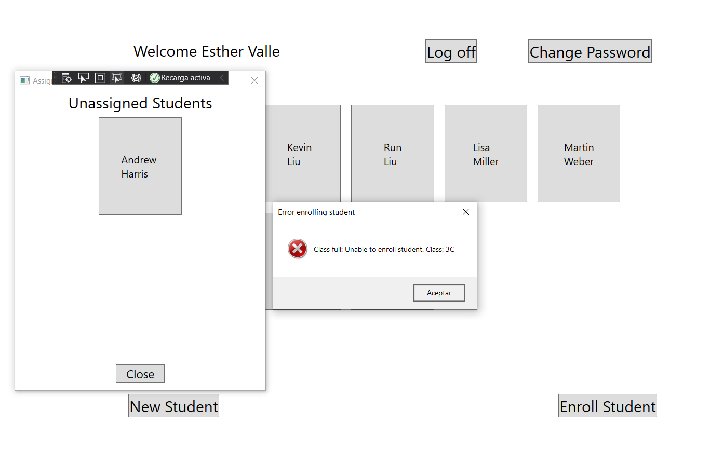

# Module 5: Creating a Class Hierarchy by Using Inheritance
## Exercise 3: Creating the ClassFullException Custom Exception
### Nombres y apellidos:
Miguel Ángel Cabrero Luengo
### Fecha:
01/11/2020
### Resumen del Ejercicio:

#### Objetivo del ejercicio:
- Incluir gestión de excepciones en la clase para capturar errores.

#### Tareas realizadas:

- Creación de la clase ClassFullException 

- Captura y proceso de eventos para la clase ClassFullException

Resultados de ejecución:

#### Apertura de aplicación con el rol de profesor:

#### Creación de un nuevo estudiante:

#### Captura de excepción de error, al asociar a un alumno a una aula llena:

### Dificultad o problemas presentados y cómo se resolvieron:
No se encontraron problemas.

