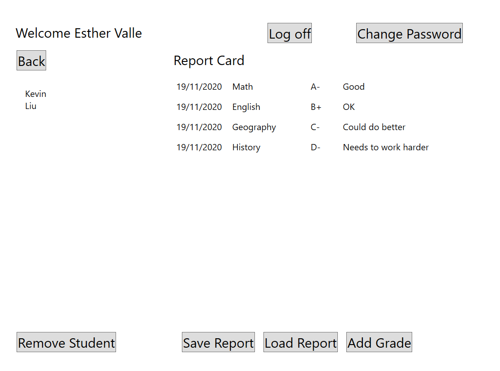
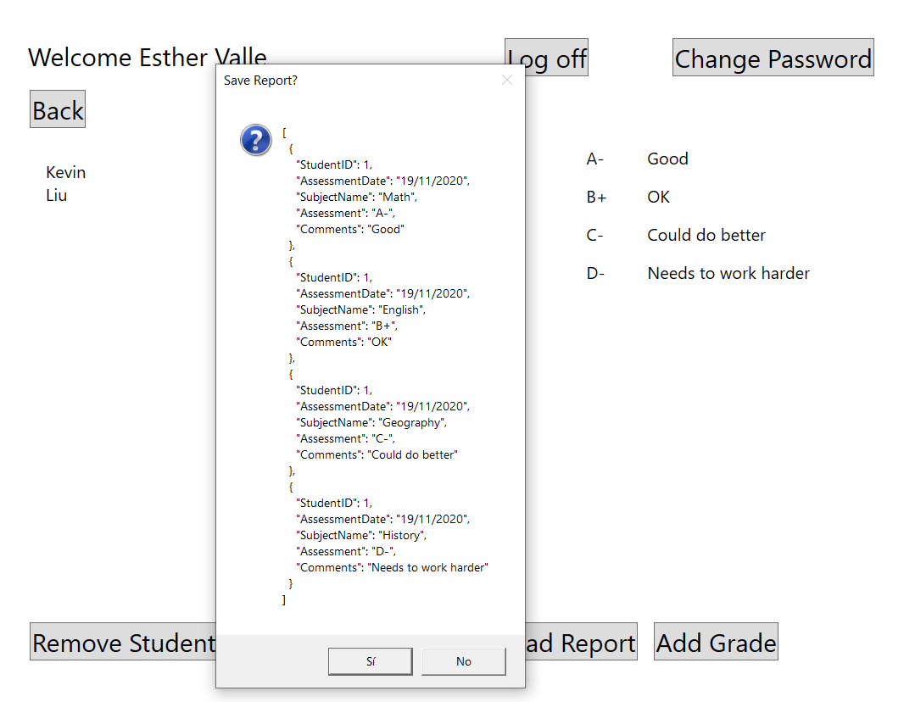
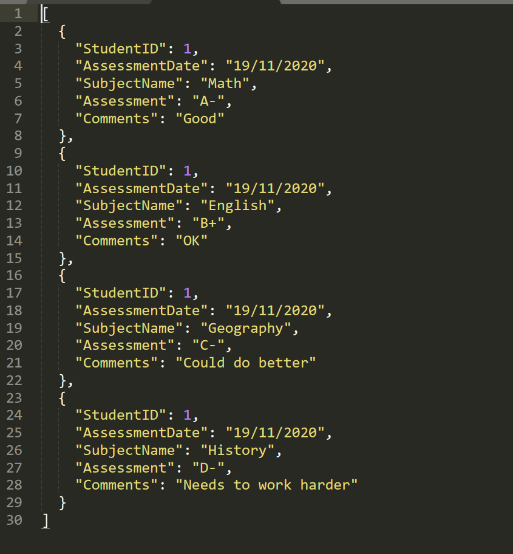

# Module 6: Reading and Writing Local Data
## Exercise 1: Serializing Data for the Grades Report as JSON
### Nombres y apellidos:
Miguel Ángel Cabrero Luengo
### Fecha:
01/11/2020
### Resumen del Ejercicio:

#### Objetivo del ejercicio:
- Serialización de objetos usando JSON.Net

- Dada una consulta, exportar/importar sus datos a un fichero json 

#### Tareas realizadas:

- Se instala el paquete Newtonsoft.Json

- Se añade código para preguntar por la carpeta destino

- Se usa JsonConvert para serializar el contenido a un fichero

- Grabación de json usando FileStream
 
Resultados de ejecución:

#### Muestra de datos un usuario, ofreciendo opciones de grabar cargar datos en fichero json:

#### Serialización de datos y confirmación de grabación en fichero json:

#### fichero resultante tras la grabación en disco:

### Dificultad o problemas presentados y cómo se resolvieron:
No se ha encontrado dificultades.

