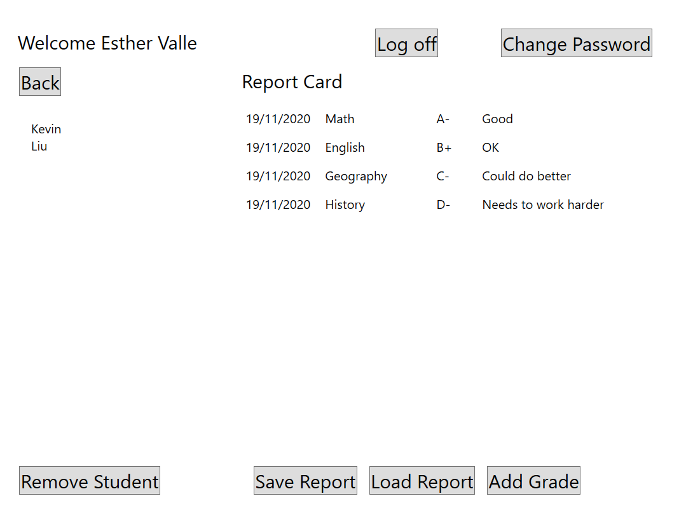
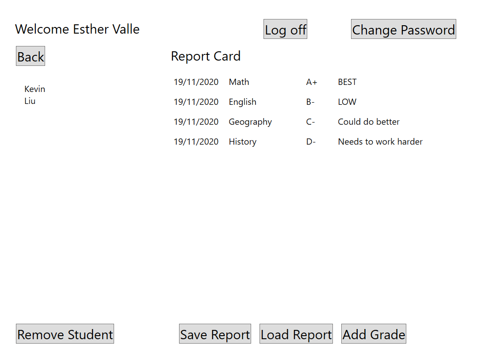

# Module 6: Reading and Writing Local Data
## Exercise 2: Deserialize Data from the JSON Report to Grades Object
### Nombres y apellidos:
Miguel Ángel Cabrero Luengo
### Fecha:
01/11/2020
### Resumen del Ejercicio:

#### Objetivo del ejercicio:
- De-Serialización de objetos usando JSON.Net

#### Tareas realizadas:

- Se instala el paquete Newtonsoft.Json

- Se incluye código para preguntar por el archivo json

- Se obtiene el contenido del fichero json

- Se actualizan los contenidos de Json en la fichero del usuario seleccionado
 
Resultados de ejecución:

#### Consulta de un alumno tras acceso de aplicación con perfil de profesor:

#### Datos actualizados del usuario tras abrir el json:

### Dificultad o problemas presentados y cómo se resolvieron:
No se han encontrado problemas.

