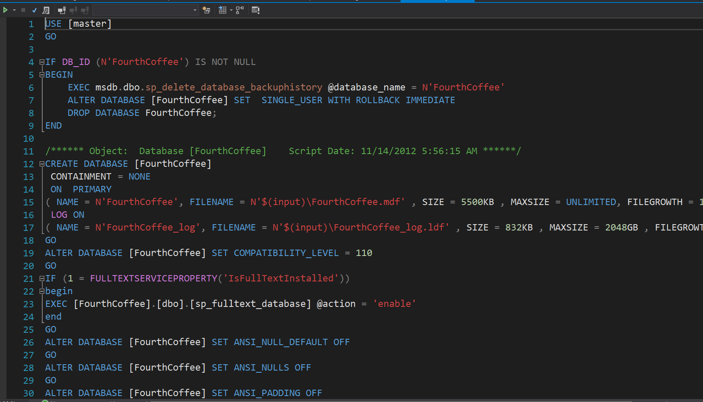
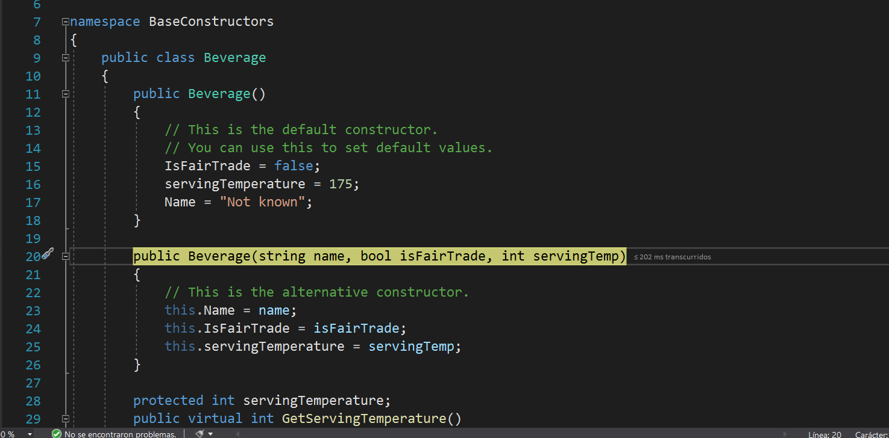
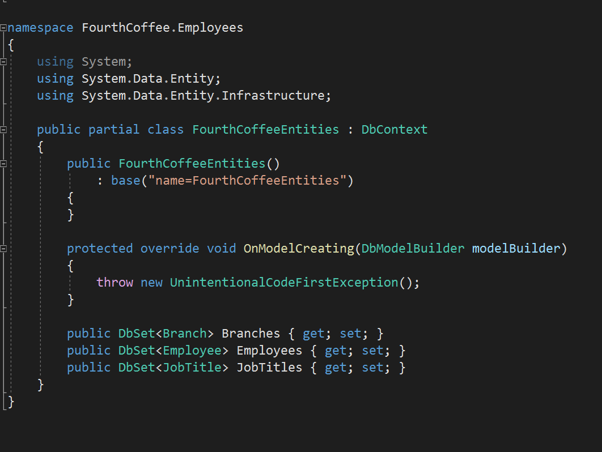
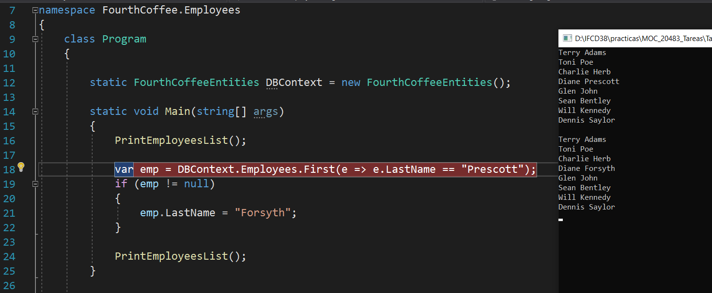

# Module 7: Accessing a Database
## Lesson 1: Creating and Using Entity Data Models
### Nombres y apellidos:
Miguel Ángel Cabrero Luengo
### Fecha:
01/11/2020
### Resumen del Ejercicio:

#### Objetivo del ejercicio:
- Creación de un modelo de entidades a partir de una base de datos.

- Modificación de un contenido.

#### Tareas realizadas:

- Se crea la base de datos lanzando el script sql correspondiente

- Se Valida la creación de las clases vinculadas a los datos.

- Creación automática de las clases que accederán a los datos.
 
Resultados de ejecución:

#### Script SQL utilizado:

#### Entidades seleccionadas de la base de datos:

#### Clases generadas automáticamente de acceso a datos:

#### Validación de modificación de datos:

### Dificultad o problemas presentados y cómo se resolvieron:
Hubo que crear la base de datos para poder realizar el ejemplo.

