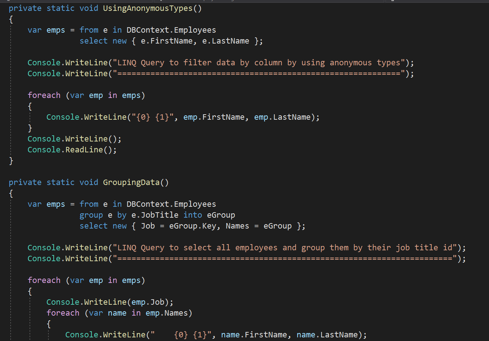
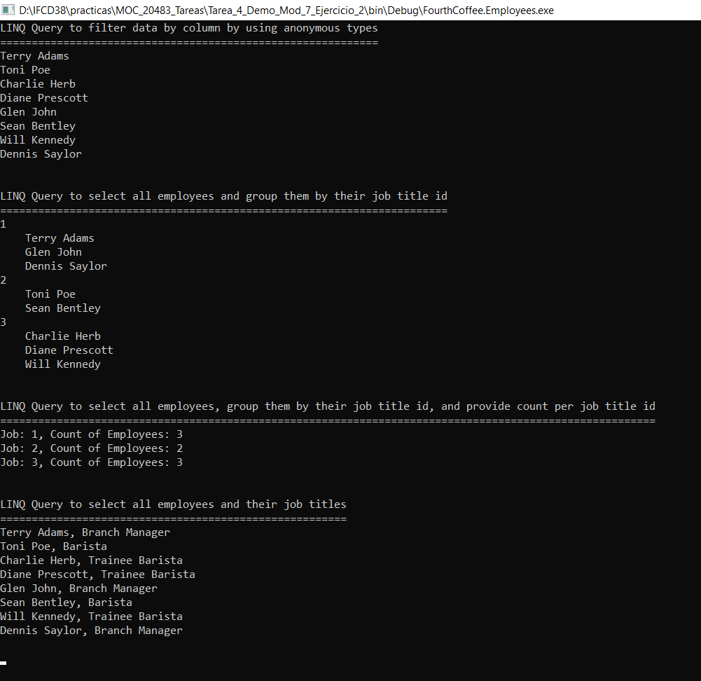

# Module 7: Accessing a Database
## Lesson 2: Querying Data by Using LINQ
### Nombres y apellidos:
Miguel Ángel Cabrero Luengo
### Fecha:
01/11/2020
### Resumen del Ejercicio:

#### Objetivo del ejercicio:
- Creación de un modelo de entidades a partir de una base de datos.

- Consulta de un contenido mediante Linq.

#### Tareas realizadas:

- Se crea la base de datos lanzando el script sql correspondiente

- Validación de diferentes consultas con Linq.
 
Resultados de ejecución:

#### Consultas Linq utilizado:

#### Resultado de consultas Linq:

### Dificultad o problemas presentados y cómo se resolvieron:
Hubo que crear la base de datos para poder realizar el ejemplo.

