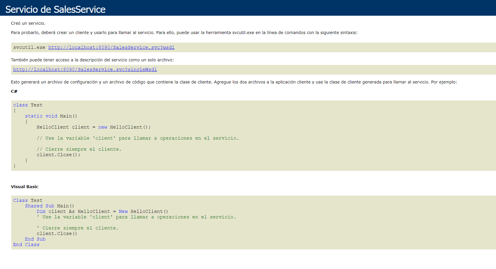
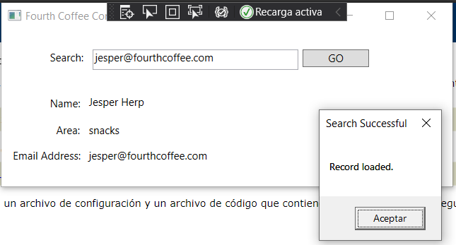

# Module 8: Accessing Remote Data
## Lesson 1: Accessing Data Across the Web
### Nombres y apellidos:
Miguel Ángel Cabrero Luengo
### Fecha:
01/11/2020
### Resumen del Ejercicio:

#### Objetivo del ejercicio:
- Acceder a datos a través de un servicio Web

#### Tareas realizadas:

- Se crean tres proyectos, uno con la estructura de datos, otro con el servicio de acceso a datos y un tercero que llama al servicio de acceso a datos.
 
- Enlace al proyecto <a href="../Tarea_4_Demo_Mod_8_Ejercicio_1_Infrastructure">Infraestructura.</a>

- Enlace al proyecto <a href="../Tarea_4_Demo_Mod_8_Ejercicio_1__DataService">Servicio de Datos.</a>

- Enlace al proyecto <a href="../Tarea_4_Demo_Mod_8_Ejercicio_1_ContactFinder">Buscador de contactos.</a>

Resultados de ejecución:

#### Ejecución del servicio de acceso a datos:

#### Ejecución de la llamada al servicio:

### Dificultad o problemas presentados y cómo se resolvieron:
Hubo que crear la base de datos para poder realizar el ejemplo.

