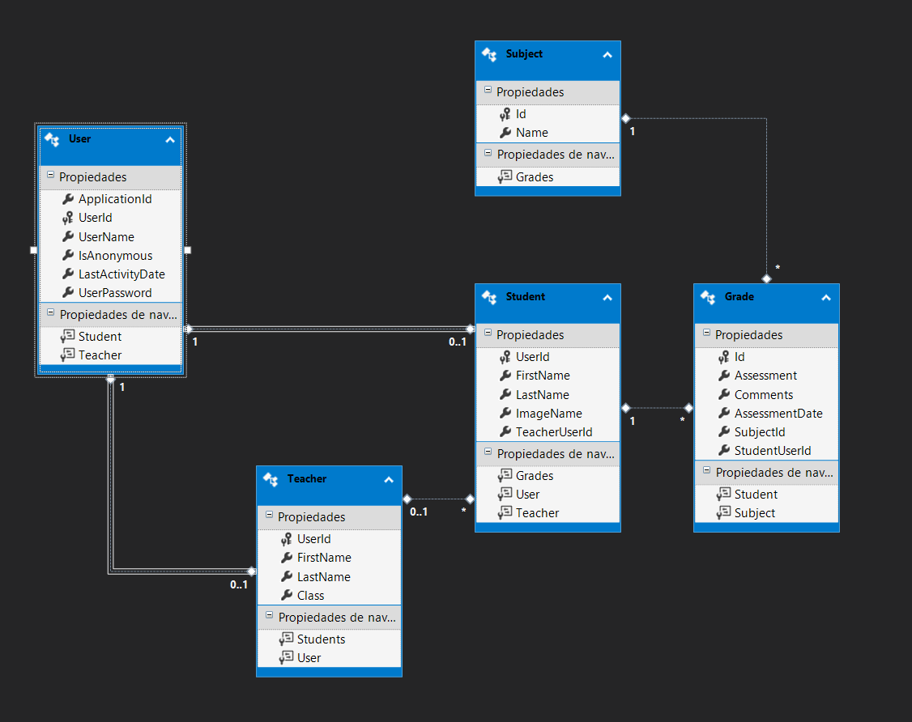

# Module 7: Accessing a Database
## Exercise 1: Creating an Entity Data Model from The School of Fine Arts Database
### Nombres y apellidos:
Miguel Ángel Cabrero Luengo
### Fecha:
01/11/2020
### Resumen del Ejercicio:

#### Objetivo del ejercicio:
- Creación de un modelo de entidades a partir de una base de datos.

#### Tareas realizadas:

- Creación de la base de datos.

- Creación del Entity Data Model
 
- Enlace al proyecto <a href="../Tarea_4_Lab_Mod_7_Ejercicio_1.DataModel">Modelo de Datos.</a>

- Enlace al proyecto <a href="../Tarea_4_Lab_Mod_7_Ejercicio_1.Prototype">Prototipo para consumo del modelo dde datos.</a>

Resultados de ejecución:

#### Entidades importadas del modelo de datos:

### Dificultad o problemas presentados y cómo se resolvieron:
Hubo que crear la base de datos para poder realizar el ejemplo.

