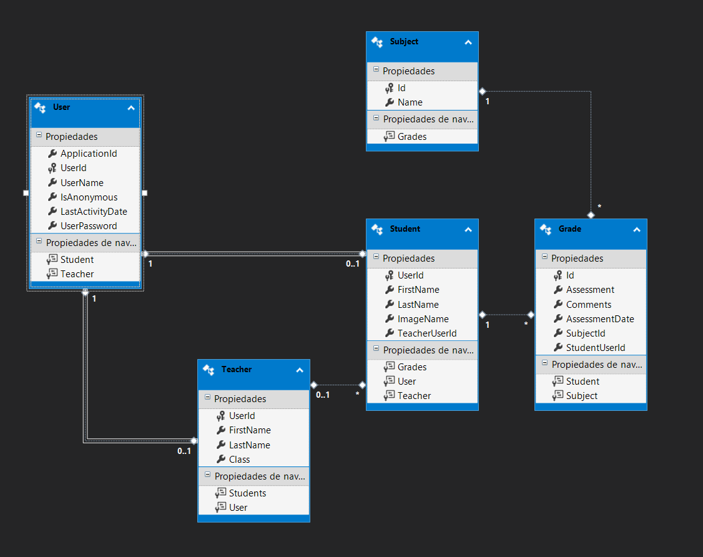
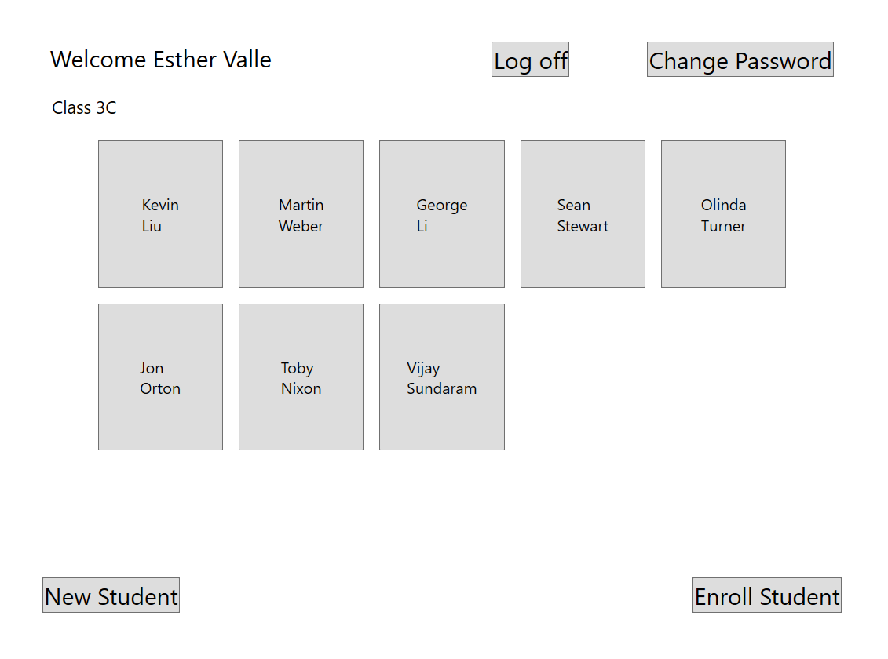
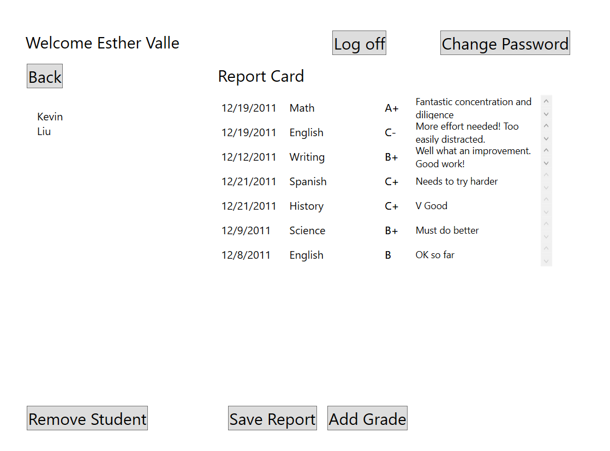

# Module 7: Accessing a Database
## Exercise 2: Updating Student and Grade Data by Using the Entity Framework
### Nombres y apellidos:
Miguel Ángel Cabrero Luengo
### Fecha:
01/11/2020
### Resumen del Ejercicio:

#### Objetivo del ejercicio:
- Actualización de contenidos obtenidos a partir de un Entity Data Model

#### Tareas realizadas:

- Creación de la base de datos.

- Creación del Entity Data Model
 
- Enlace al proyecto <a href="../Tarea_4_Lab_Mod_7_Ejercicio_2.DataModel">Modelo de Datos.</a>

- Enlace al proyecto <a href="../Tarea_4_Lab_Mod_7_Ejercicio_2.Prototype">Prototipo para consumo del modelo dde datos.</a>

Resultados de ejecución:

#### Entidades importadas del modelo de datos:

#### Datos obtenidos de la base de datos:

#### Datos obtenidos de la base de datos mostrando descripción de la calificación, no el id:

### Dificultad o problemas presentados y cómo se resolvieron:
Hubo que crear la base de datos para poder realizar el ejemplo.

