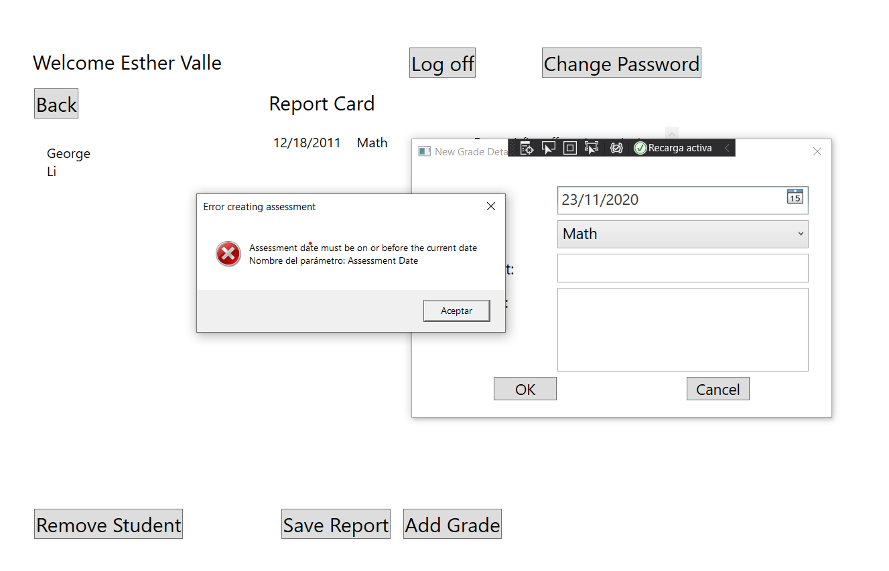
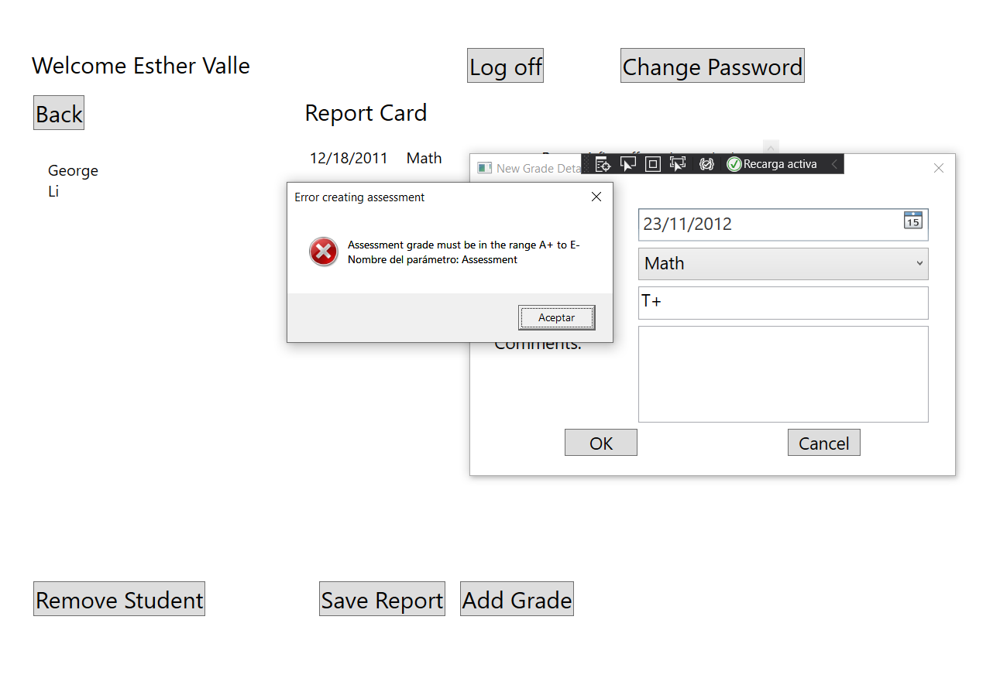
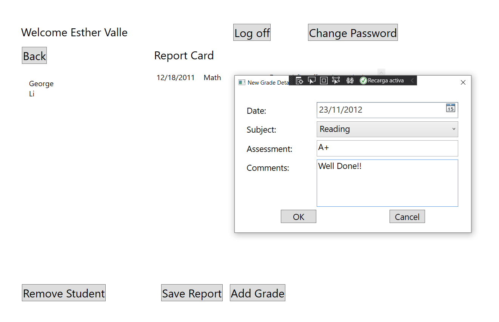
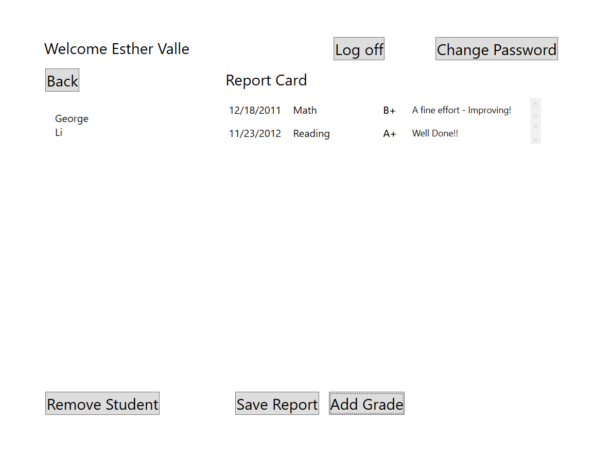

# Module 7: Accessing a Database
## Exercise 3: Extending the Entity Data Model to Validate Data
### Nombres y apellidos:
Miguel Ángel Cabrero Luengo
### Fecha:
01/11/2020
### Resumen del Ejercicio:

#### Objetivo del ejercicio:
- Añadir excepciones para validar cambios de contenidos obtenidos a partir de un Entity Data Model

#### Tareas realizadas:

- Creación de la base de datos.

- Creación del Entity Data Model

- Incorporación de validaciones mediante excepciones 
 
- Enlace al proyecto <a href="../Tarea_4_Lab_Mod_7_Ejercicio_3.DataModel">Modelo de Datos.</a>

- Enlace al proyecto <a href="../Tarea_4_Lab_Mod_7_Ejercicio_3.Prototype">Prototipo para consumo del modelo dde datos.</a>

Resultados de ejecución:

#### Validación de contenidos al introducir una fecha errónea:

#### Validación de contenidos al introducir una calificación errónea:

#### Introducción de contenidos de una calificación y fecha correcta:

#### Aceptación de contenidos al introducir una calificación y fecha correcta:

### Dificultad o problemas presentados y cómo se resolvieron:
Hubo que crear la base de datos para poder realizar el ejemplo.

