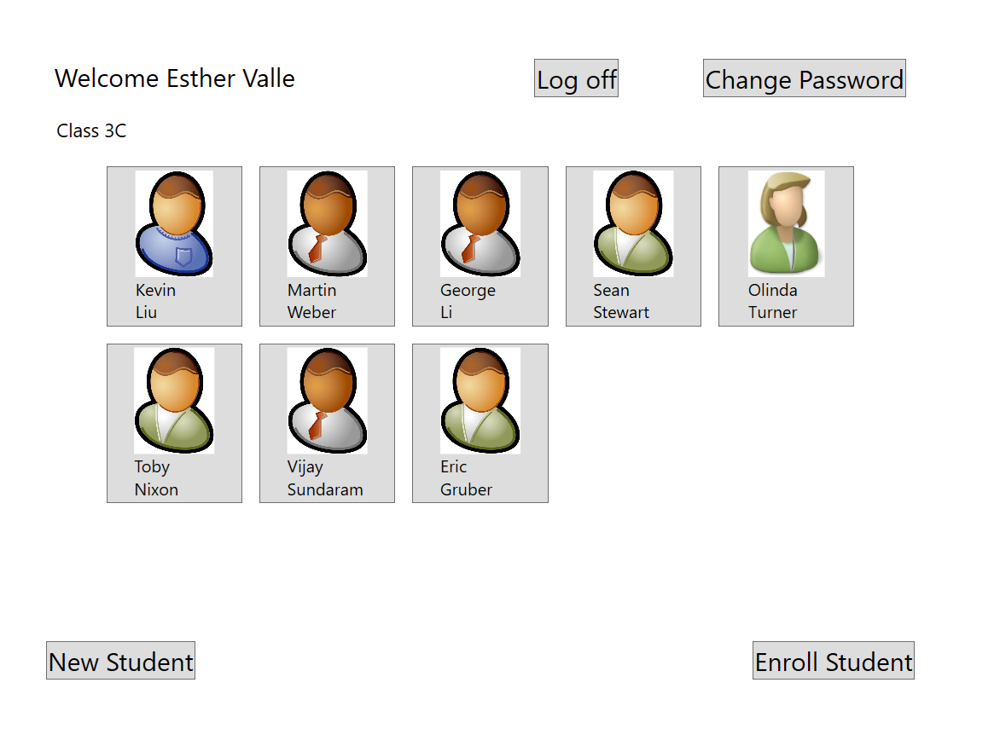
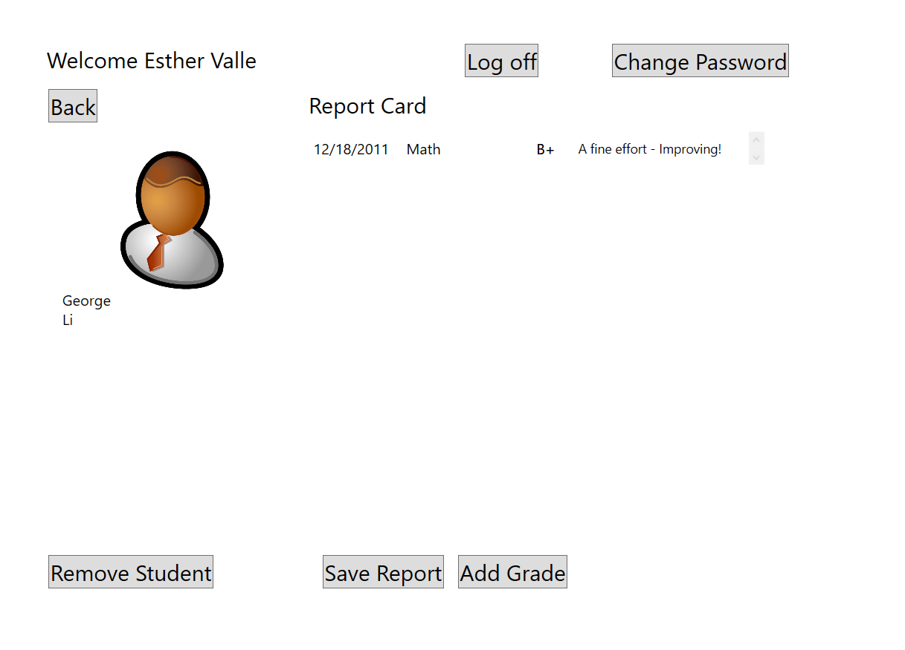

# Module 8: Accessing Remote Data
## Exercise 3: Retrieving Student Photographs Over the Web (If Time Permits)
### Nombres y apellidos:
Miguel Ángel Cabrero Luengo
### Fecha:
01/11/2020
### Resumen del Ejercicio:

#### Objetivo del ejercicio:
- incluir imágenes en las fichas de los alumnos

#### Tareas realizadas:

- Creación de la base de datos SetupSchoolGradesDB.

- Instalación de Microsoft.OData.ConnectedService

- Instalación de WcfDataServices

- Configuración data service y añadir referencias al entityframework para acceder a la base de datos

- Conectar el WCF Data Service al proyecto prototipo

- Incluir código para mostrar una imagen por cada alumno
 
- Enlace al proyecto <a href="../Tarea_4_Lab_Mod_8_Ejercicio_3.DataModel">Modelo de Datos.</a>

- Enlace al proyecto <a href="../Tarea_4_Lab_Mod_8_Ejercicio_3.Prototype">Prototipo para consumo del modelo de datos.</a>

- Enlace al proyecto <a href="../Tarea_4_Lab_Mod_8_Ejercicio_3.Web">Prototipo para servicio web.</a>

Resultados de ejecución:

#### Acceso a la aplicación y visualización de alumnos con foto:

#### Acceso al detalle de un alumno, visualizando su foto:

### Dificultad o problemas presentados y cómo se resolvieron:
No se encontraron problemas.

