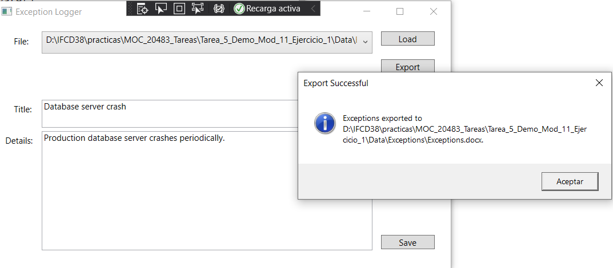
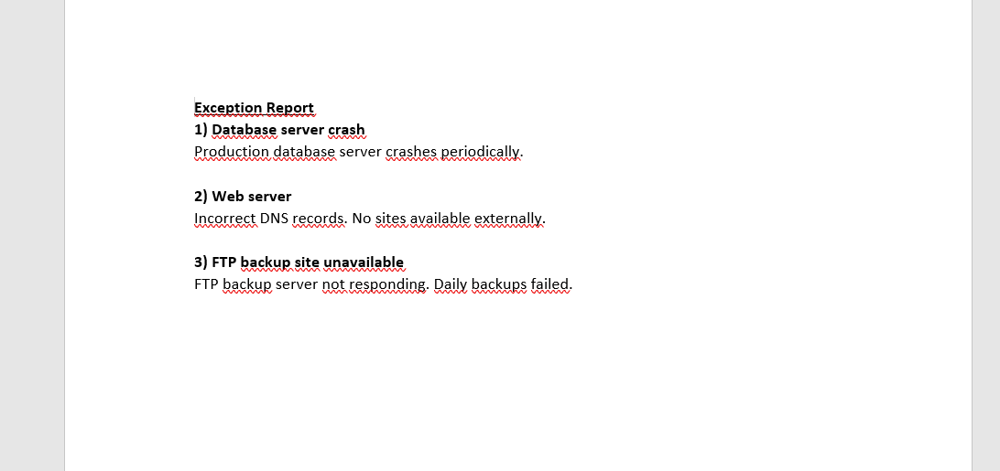

# Module 11: Integrating with Unmanaged Code
## Lesson 1: Creating and using Dynamic Objects
### Nombres y apellidos:
Miguel Ángel Cabrero Luengo
### Fecha:
01/11/2020
### Resumen del Ejercicio:

#### Objetivo del ejercicio:
- Trabajar con objetos de forma dinámica (crear documentos word)

#### Tareas realizadas:

- Usando la libreria interop se exporta los ficheros de log a Word
 
Resultados de ejecución:

#### Seleccion del log a exportar:

#### Resultado en word de la exportación:

### Dificultad o problemas presentados y cómo se resolvieron:
No se encontraron problemas.

