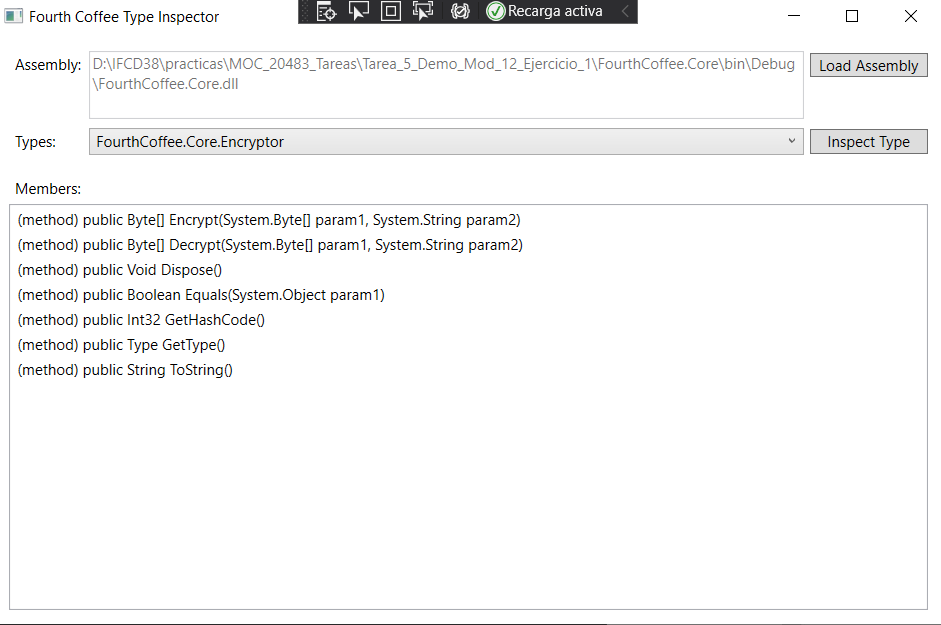

# Module 12: Creating Reusable Types and Assemblies
## Lesson 1: Examining Object Metadata
### Nombres y apellidos:
Miguel Ángel Cabrero Luengo
### Fecha:
01/11/2020
### Resumen del Ejercicio:

#### Objetivo del ejercicio:
- Obtener los métodos que tiene una librería

#### Tareas realizadas:

- Usando la libreria Reflection se obrtiene la información de la librería seleccionada
 
Resultados de ejecución:

#### Métodos de la dll seleccionada:

### Dificultad o problemas presentados y cómo se resolvieron:
No se encontraron problemas.

