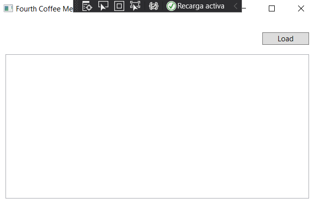
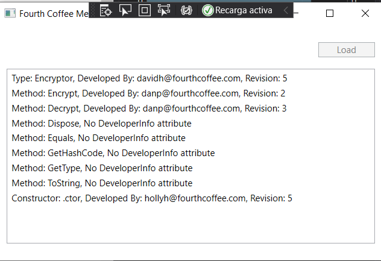

# Module 12: Creating Reusable Types and Assemblies
## Lesson 2: Creating and Using Custom Attributes
### Nombres y apellidos:
Miguel Ángel Cabrero Luengo
### Fecha:
01/11/2020
### Resumen del Ejercicio:

#### Objetivo del ejercicio:
- Obtener los atributos personalizados de un método

#### Tareas realizadas:

- Usando type.GetCustomAttribute y member.GetCustomAttribute se obtiene la información buscada
 
Resultados de ejecución:

#### Inicio de la aplicación:

#### Resultado consulta de atributos:

### Dificultad o problemas presentados y cómo se resolvieron:
No se encontraron problemas.

