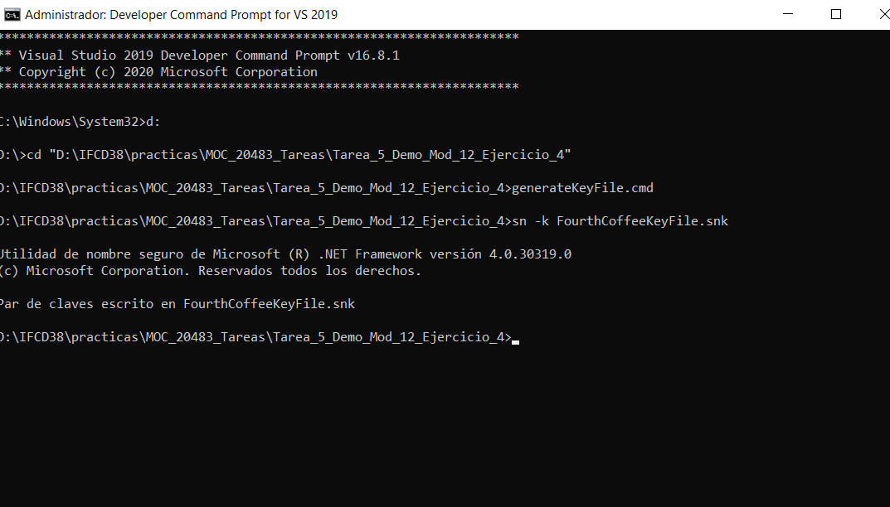
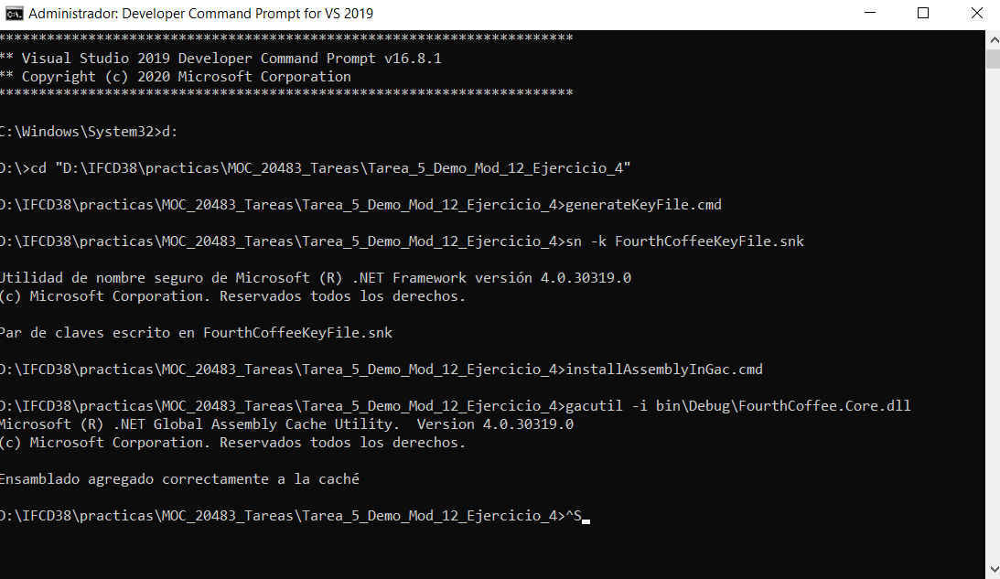
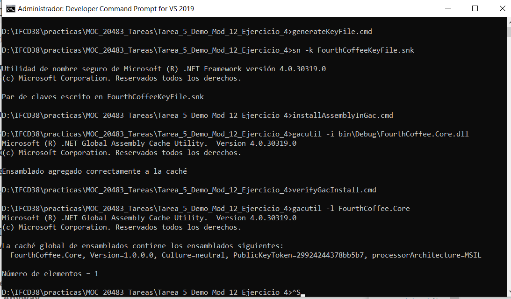

# Module 12: Creating Reusable Types and Assemblies
## Lesson 4: Versioning, Signing, and Deploying Assemblies
### Nombres y apellidos:
Miguel Ángel Cabrero Luengo
### Fecha:
01/11/2020
### Resumen del Ejercicio:

#### Objetivo del ejercicio:
- Firmar e instalar un ensamblado en la GAC

#### Tareas realizadas:

- Ejecución de script de firmado e instalación.
 
Resultados de ejecución:

#### Resultado de ejecutar generateKeyFile.cmd:

#### Resultado de ejecutar installAssemblyInGac.cmd:

#### Resultado de ejecutar verifyGacInstall.cmd:

### Dificultad o problemas presentados y cómo se resolvieron:
No se encontraron problemas.

