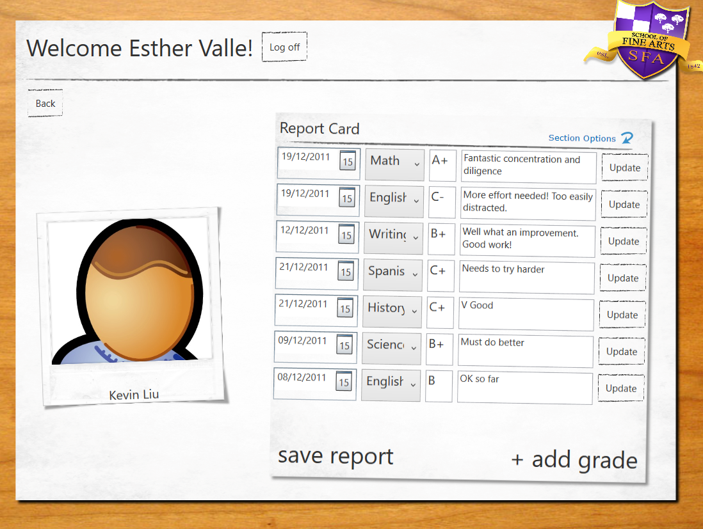

# Module 11: Integrating with Unmanaged Code
## Exercise 1: Generating the Grades Report by Using Word
### Nombres y apellidos:
Miguel Ángel Cabrero Luengo
### Fecha:
01/11/2020
### Resumen del Ejercicio:

#### Objetivo del ejercicio:
- Generar un informe con word

#### Tareas realizadas:

- incorporación de la librería interop para generar documentos word..
 
Resultados de ejecución:

#### Acceso a la aplicación:

#### Consulta detralle de un alumno:

#### Exportación de ddatos de un alumno a Word.:

### Dificultad o problemas presentados y cómo se resolvieron:
No se encontraron problemas.

