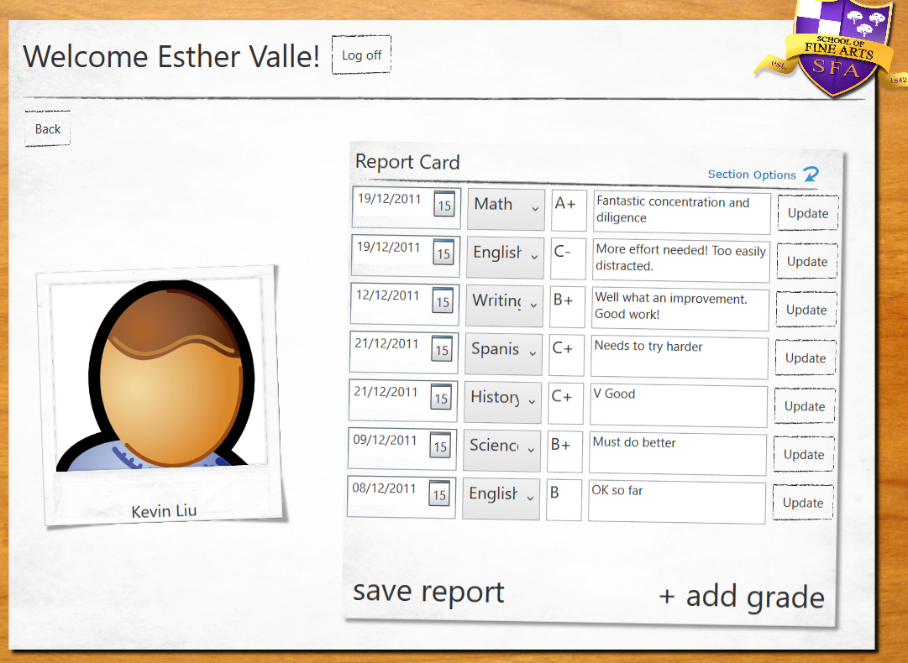

# Module 11: Integrating with Unmanaged Code
### Exercise 2: Controlling the Lifetime of Word Objects by Implementing the Dispose Pattern

### Nombres y apellidos:
Miguel Ángel Cabrero Luengo
### Fecha:
01/11/2020
### Resumen del Ejercicio:

#### Objetivo del ejercicio:
- Generar un informe con word y asegurar la eliminación de la instancia levantada de word

#### Tareas realizadas:

- incorporación de la librería interop para generar documentos word incluyendo la eliminación de la instancia creada a word
 
Resultados de ejecución:

#### Acceso a la aplicación:

#### Consulta detalle de un alumno:

#### Instanacia en memoria de word durante exportación:

#### Eliminación instanacia en memoria de word tras exportación:

#### Exportación de datos de un alumno a Word.:

### Dificultad o problemas presentados y cómo se resolvieron:
No se encontraron problemas.

