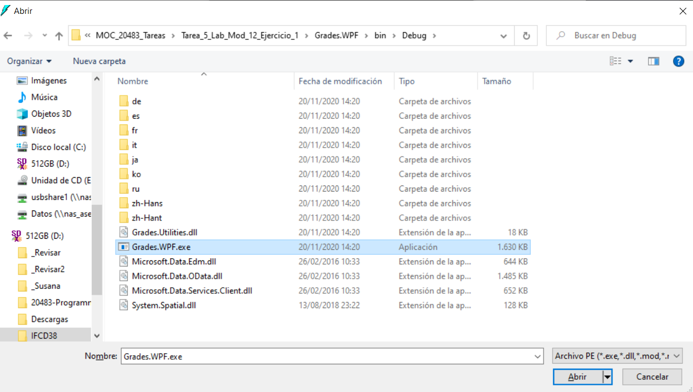
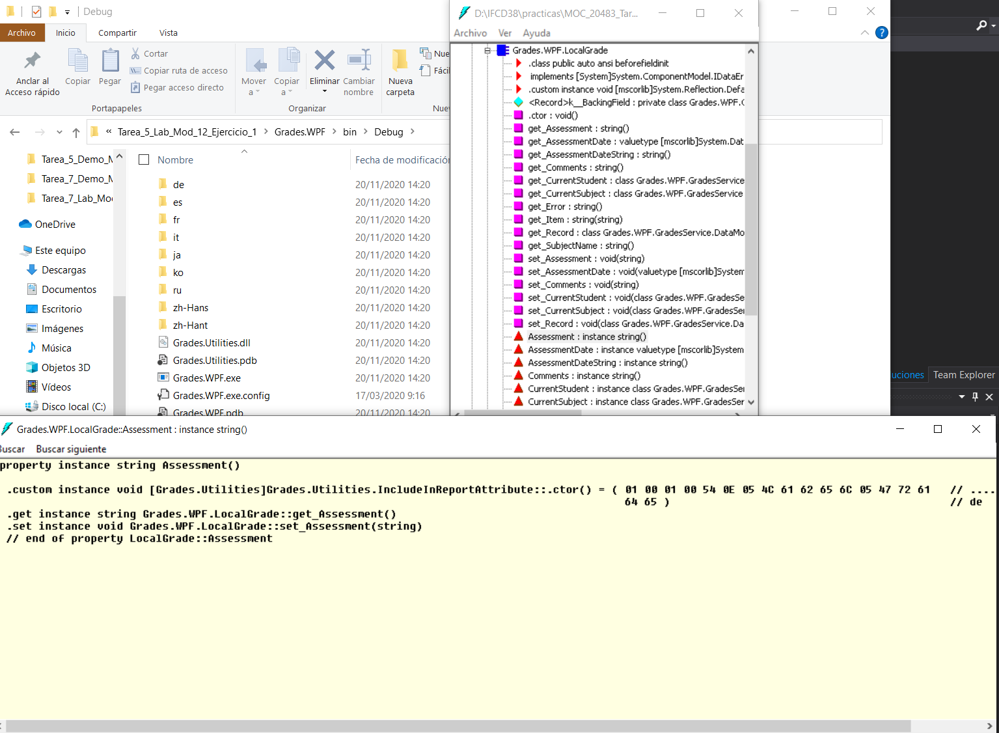
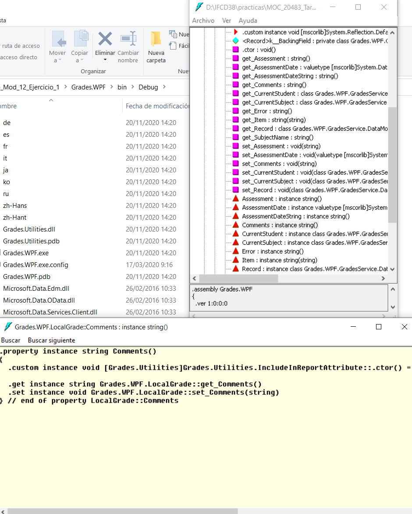

# Module 12: Creating Reusable Types and Assemblies
### Exercise 1: Creating and Applying the IncludeInReport attribute

### Nombres y apellidos:
Miguel Ángel Cabrero Luengo
### Fecha:
01/11/2020
### Resumen del Ejercicio:

#### Objetivo del ejercicio:
- Revisar atributos del binerio de la aplicación

#### Tareas realizadas:

- Mediante la herramienta IL DASM se revisa el detalle del binario generado.
 
Resultados de ejecución:

#### Acceso al binario de la aplicación con la herramienta  IL DASM:

#### Consulta detalle de AssessmentDateString : instance string():

#### Consulta detalle de Comments : instance string():

#### Eliminación instanacia en memoria de word tras exportación:

#### Exportación de datos de un alumno a Word.:

### Dificultad o problemas presentados y cómo se resolvieron:
No se encontraron problemas.

