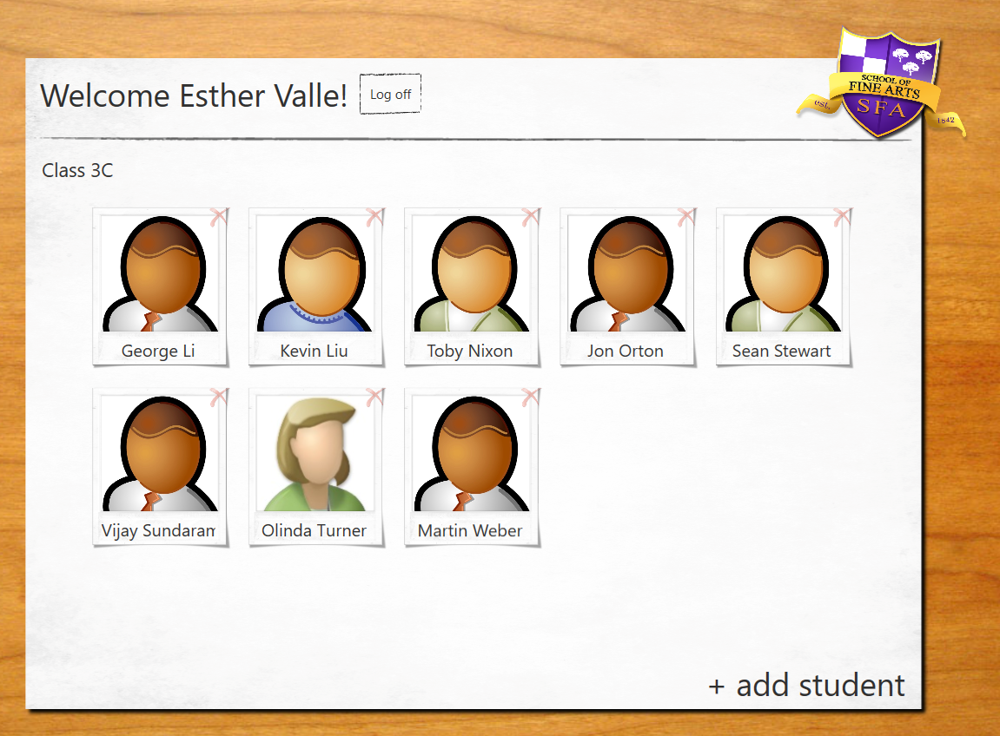
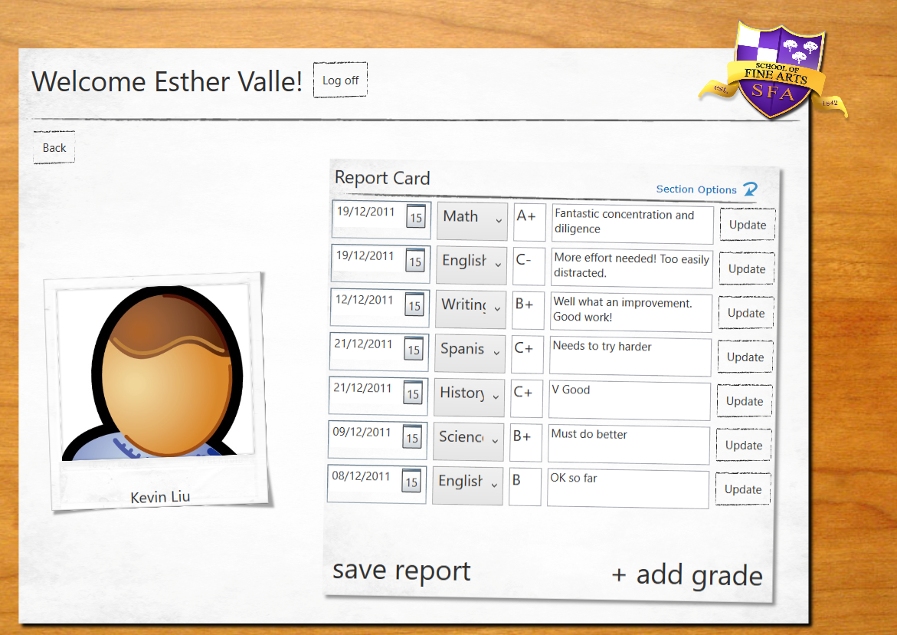
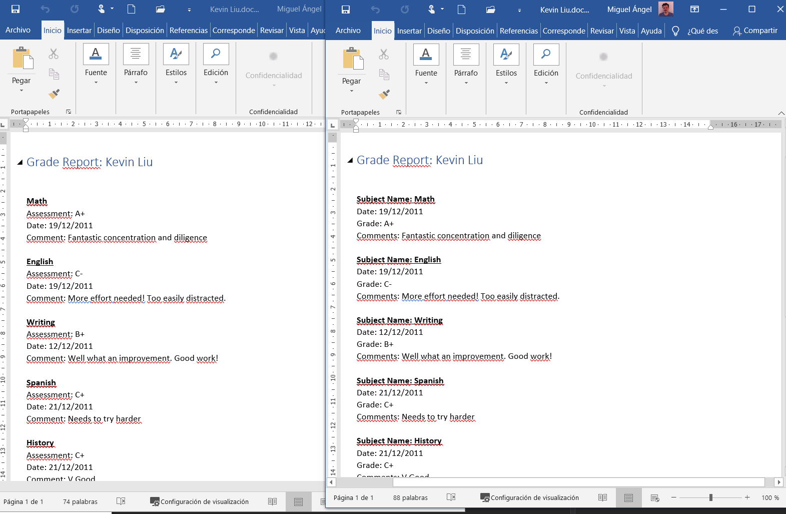

# Module 12: Creating Reusable Types and Assemblies
### Exercise 2: Updating the Report

### Nombres y apellidos:
Miguel Ángel Cabrero Luengo
### Fecha:
01/11/2020
### Resumen del Ejercicio:

#### Objetivo del ejercicio:
- Mejorar informes previos de expedientes en word.

#### Tareas realizadas:

- Mediante la herramienta interop se instancia word para crear un nuevo informe más completo
 
Resultados de ejecución:

#### inicio a la aplicación:

#### Consulta detalle de un alumno:

#### informe generado en word actualizado (versión derecha):

#### Eliminación instanacia en memoria de word tras exportación:

#### Exportación de datos de un alumno a Word.:

### Dificultad o problemas presentados y cómo se resolvieron:
No se encontraron problemas.

