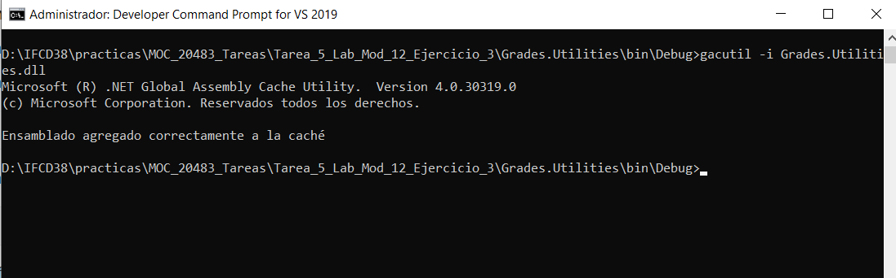

# Module 12: Creating Reusable Types and Assemblies
### Exercise 3: Storing the Grades.Utilities Assembly Centrally (if time permits)

### Nombres y apellidos:
Miguel Ángel Cabrero Luengo
### Fecha:
01/11/2020
### Resumen del Ejercicio:

#### Objetivo del ejercicio:
- Mejorar informes previos de expedientes en word.

#### Tareas realizadas:

- Mediante la herramienta interop se instancia word para crear un nuevo informe más completo
 
Resultados de ejecución:

#### creación fichero GradesKey.snk:

#### Agregación de ensamblado a la caché:

#### Agregación de referencia a la dll del proyecto utilities:

#### inicio de la aplicación:

#### Consulta detalles de un alumno:

#### Generación informe en word:

### Dificultad o problemas presentados y cómo se resolvieron:
No se encontraron problemas.

