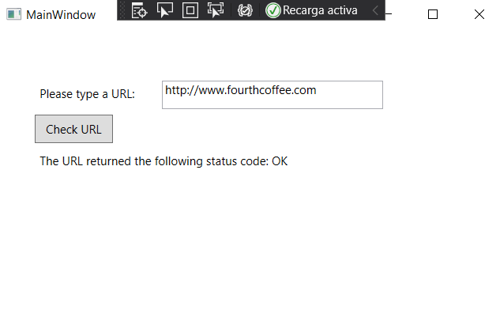

# Module 10:   Improving Application Performance and Responsiveness
## Lesson 2:  Performing Operations Asynchronously
### Nombres y apellidos:
Miguel Ángel Cabrero Luengo
### Fecha:
01/11/2020
### Resumen del Ejercicio:

#### Objetivo del ejercicio:
- Mostrar la carga de una página mediante HttpWebRequest

#### Tareas realizadas:

- Acceso asíncrono a una web y mostrar su respuesta.

Resultados de ejecución:

#### Acceso a la web y su respuesta:

### Dificultad o problemas presentados y cómo se resolvieron:
No se encontraron problemas.

