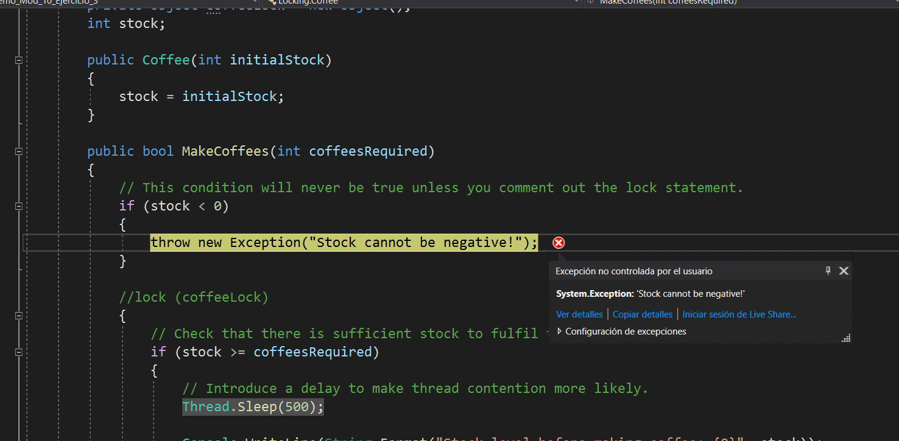

# Module 10:   Improving Application Performance and Responsiveness
## Lesson 3:  Synchronizing Concurrent Access to Data
### Nombres y apellidos:
Miguel Ángel Cabrero Luengo
### Fecha:
01/11/2020
### Resumen del Ejercicio:

#### Objetivo del ejercicio:
- Mostrar acceso concurrente

#### Tareas realizadas:

- Ejecución de llamadas concurrentes.

Resultados de ejecución:

#### Inicio del proceso con llamadas concurrentes:

#### Finalización del proceso:

### Dificultad o problemas presentados y cómo se resolvieron:
No se encontraron problemas.

