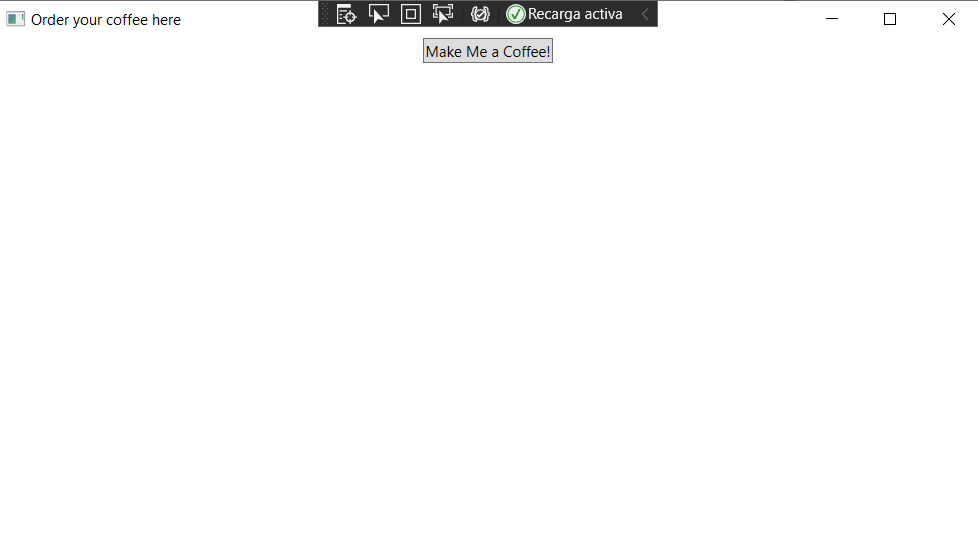
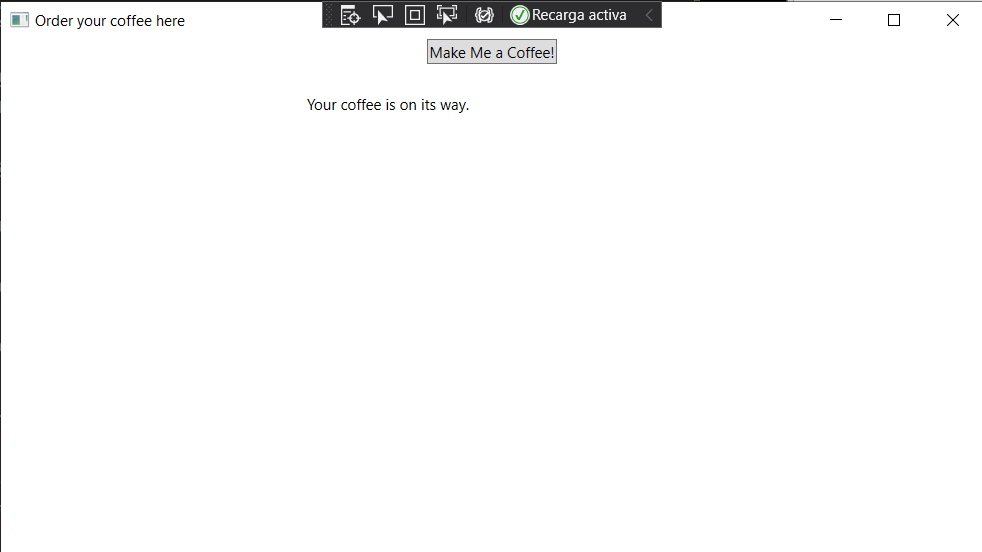

# Module 9:  Designing the User Interface for a Graphical Application
## Lesson 1:  Using XAML to Design a User Interface
### Nombres y apellidos:
Miguel Ángel Cabrero Luengo
### Fecha:
01/11/2020
### Resumen del Ejercicio:

#### Objetivo del ejercicio:
- Crear una pantalla XAML con un botón que muestre un mensaje al pulsarlo.

#### Tareas realizadas:

- Creación de un botón

- Añadir código en el evento click para mostrar un mensaje

Resultados de ejecución:

#### Inicio de aplicación, esperando pulsación del botón:

#### Resultado de pulsación del botón:

### Dificultad o problemas presentados y cómo se resolvieron:
No se encontraron problemas.

