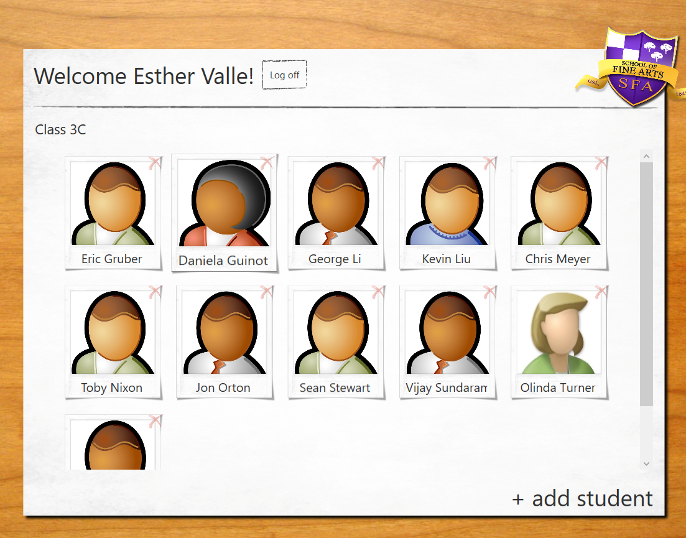

# Module 10: Improving Application Performance and Responsiveness
## Exercise 1: Ensuring That the UI Remains Responsive When Retrieving Teacher Data
### Nombres y apellidos:
Miguel Ángel Cabrero Luengo
### Fecha:
01/11/2020
### Resumen del Ejercicio:

#### Objetivo del ejercicio:
- mantener la interfaz responsive ante cambios

#### Tareas realizadas:

- Creación de la base de datos SetupSchoolGradesDB.

- Código para actualizar imágenes de usuario
 
- Enlace al proyecto <a href="../Tarea_6_Lab_Mod_10_Ejercicio_1.DataModel">Modelo de Datos.</a>

- Enlace al proyecto <a href="../Tarea_6_Lab_Mod_10_Ejercicio_1.WPF">WPF para consumo del modelo de datos.</a>

- Enlace al proyecto <a href="../Tarea_6_Lab_Mod_10_Ejercicio_1.Web">Prototipo para servicio web.</a>

Resultados de ejecución:

#### Lista de alumnos adaptable sin importar número:

### Dificultad o problemas presentados y cómo se resolvieron:
No se encontraron problemas.

