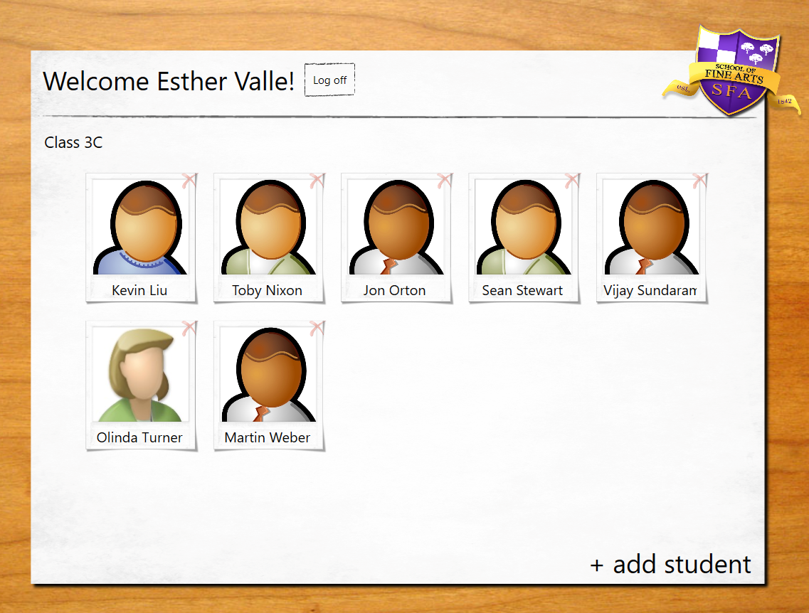
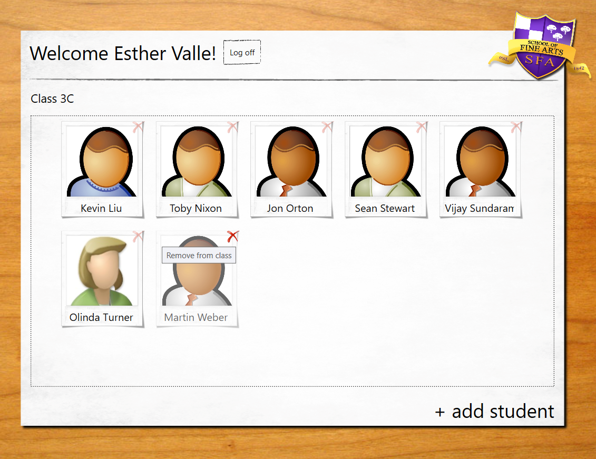
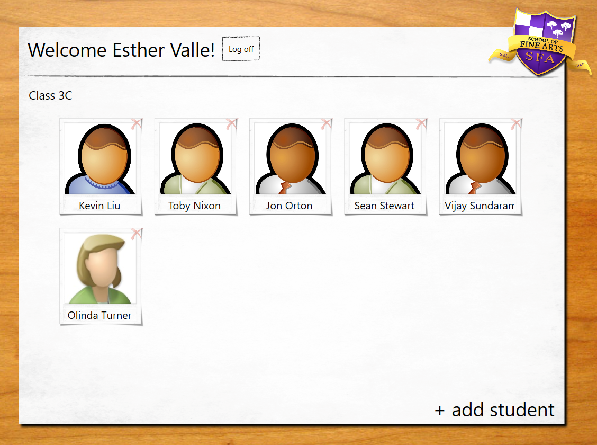

# Module 9: Designing the User Interface for a Graphical Application
## Exercise 1: Customizing the Appearance of Student Photographs
### Nombres y apellidos:
Miguel Ángel Cabrero Luengo
### Fecha:
01/11/2020
### Resumen del Ejercicio:

#### Objetivo del ejercicio:
- Mostrar imágenes en las fichas de los alumnos

#### Tareas realizadas:

- Creación de la base de datos SetupSchoolGradesDB.

- Código para actualizar imágenes de alumnosrototipo
 
- Enlace al proyecto <a href="../Tarea_6_Lab_Mod_9_Ejercicio_1.DataModel">Modelo de Datos.</a>

- Enlace al proyecto <a href="../Tarea_6_Lab_Mod_9_Ejercicio_1.WPF">WPF para consumo del modelo de datos.</a>

- Enlace al proyecto <a href="../Tarea_6_Lab_Mod_9_Ejercicio_1.Web">Prototipo para servicio web.</a>

Resultados de ejecución:

#### Lista de los alumnos de un profesor con foto:

#### Efecto dde atenuación dde una foto al pasar ratón por encima:

#### Resultado de eliminación de un usuario:

### Dificultad o problemas presentados y cómo se resolvieron:
No se encontraron problemas.

