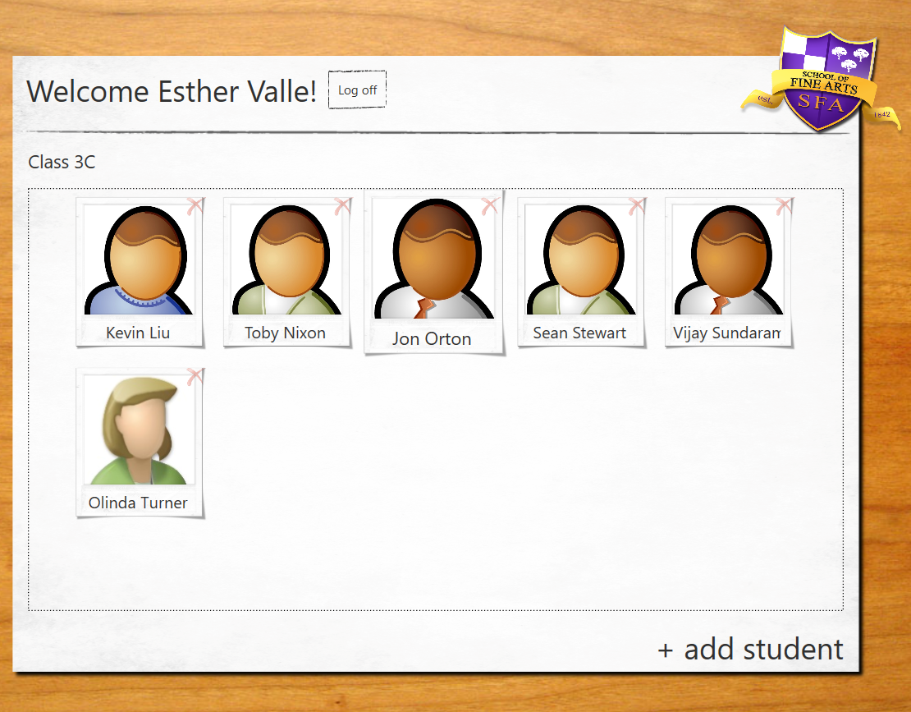

# Module 9: Designing the User Interface for a Graphical Application
## Exercise 3: Animating the StudentPhoto Control (If Time Permits)
### Nombres y apellidos:
Miguel Ángel Cabrero Luengo
### Fecha:
01/11/2020
### Resumen del Ejercicio:

#### Objetivo del ejercicio:
- Mostrar una animación de la imagen del alumno sobre el que se pase el ratón

#### Tareas realizadas:

- Creación de la base de datos SetupSchoolGradesDB.

- Código para actualizar imágenes de usuario
 
- Enlace al proyecto <a href="../Tarea_6_Lab_Mod_9_Ejercicio_3.DataModel">Modelo de Datos.</a>

- Enlace al proyecto <a href="../Tarea_6_Lab_Mod_9_Ejercicio_3.WPF">WPF para consumo del modelo de datos.</a>

- Enlace al proyecto <a href="../Tarea_6_Lab_Mod_9_Ejercicio_3.Web">Prototipo para servicio web.</a>

Resultados de ejecución:

#### icono cambiado al popner el ratón encima:

### Dificultad o problemas presentados y cómo se resolvieron:
No se encontraron problemas.

