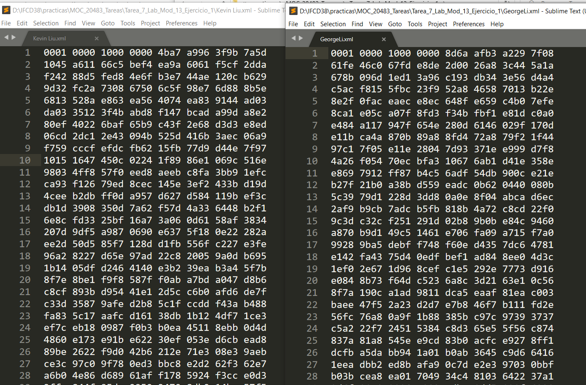

# Module 13: Encrypting and Decrypting Data

## Exercise 1: Encrypting the Grades Report

### Nombres y apellidos:

Miguel Ángel Cabrero Luengo

### Fecha:

01/11/2020

### Resumen del Ejercicio:

#### Objetivo del ejercicio:

- Cifrar un texto dado una cadena que sirva de clave

#### Tareas realizadas:

- Añadir el código para llamar servicios de cifrado

Resultados de ejecución:

#### Resultado de crear certificado:

#### Acceso a la aplicación:

#### Acceso a perfil de un alumno:

#### Resultado del cifrado:

### Dificultad o problemas presentados y cómo se resolvieron:

No se encontraron problemas.

