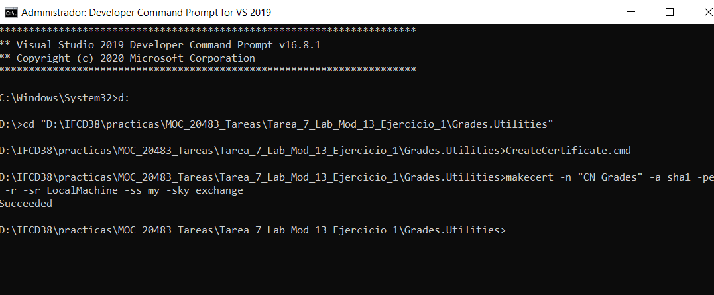
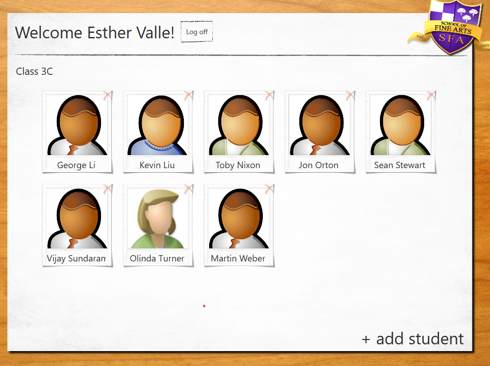
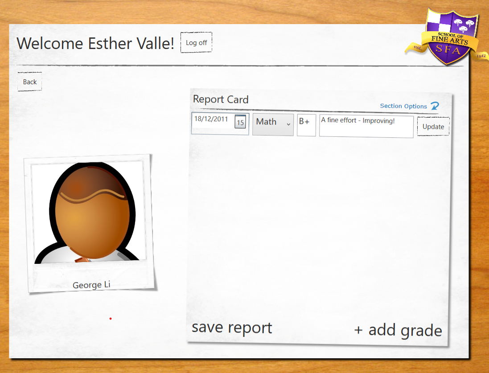

# Module 13: Encrypting and Decrypting Data
## Lesson 1: Implementing Symmetric Encryption
### Nombres y apellidos:
Miguel Ángel Cabrero Luengo
### Fecha:
01/11/2020
### Resumen del Ejercicio:

#### Objetivo del ejercicio:
- Cifrar un texto dado una cadena que sirva de clave

#### Tareas realizadas:

- Añadir el código para llamar servicios de cifrado

Resultados de ejecución:

#### Inicio de aplicación, introducir clave y texto para cifrar:

#### Cifrado realizado correctamente:

#### Resultado del cifrado:

### Dificultad o problemas presentados y cómo se resolvieron:
No se encontraron problemas.

